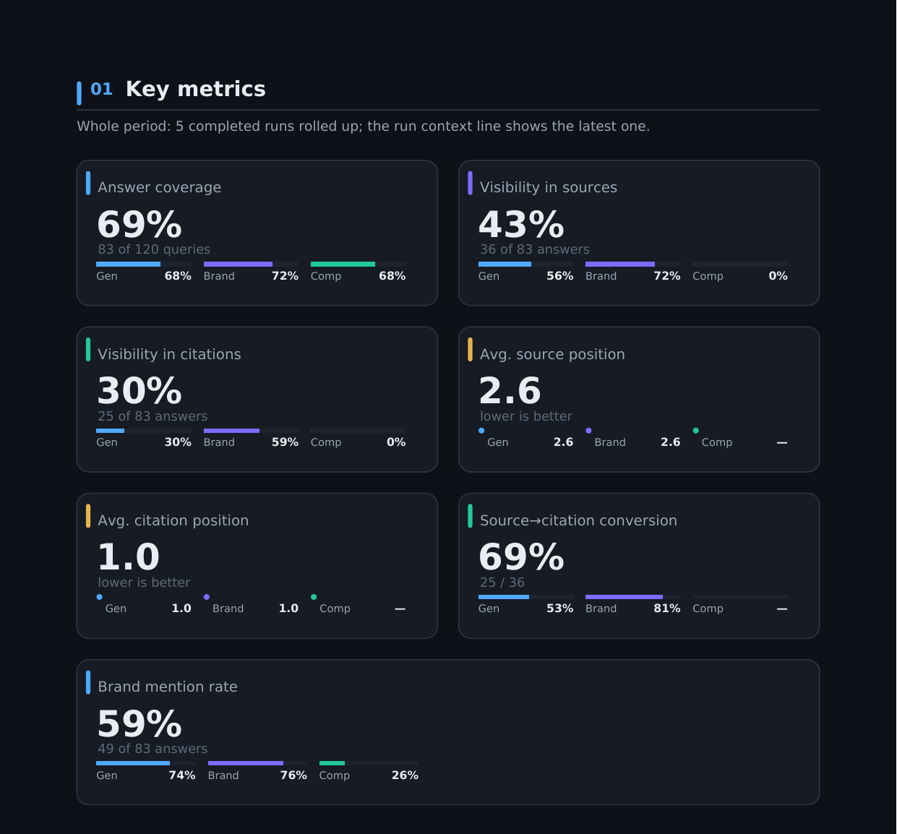
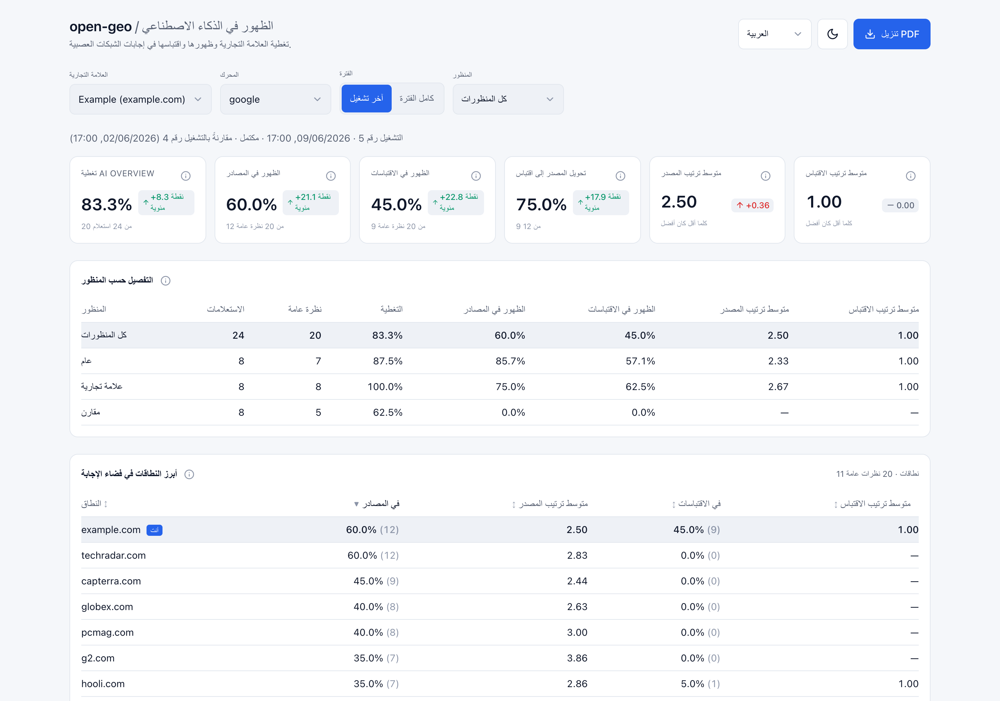

<p align="center">
  
</p>

<p align="center"><a href="README.md">English</a> · <a href="README.ru.md">Русский</a> · <a href="README.zh.md">中文</a> · <a href="README.ar.md">العربية</a></p>

# open-geo — متتبّع ظهور GEO لـ Claude Code

**‏open-geo هو متتبّع ظهور GEO (تحسين محرّكات التوليد): يقيس ما إذا كانت علامتك التجارية تظهر في
إجابات الذكاء الاصطناعي، عبر قراءة الإجابة _المُعروضة_ التي يراها فعليًّا مستخدِم مُسجَّل الدخول.**
يجري الالتقاط عبر وكيل داخل متصفّح حقيقي مُسجَّل الدخول — لا عبر واجهة المحرّك البرمجية ولا عبر
كشطٍ بلا واجهة، لأنّ هذين لا يطابقان الإجابة التي تُعرَض على إنسان. يغطّي **نظرة Google AI العامة
وChatGPT وClaude وGemini وYandex Alice وDeepSeek**، ويقدّم قمعًا صادقًا (الاستعلامات ← الإجابات ←
المصادر ← الاقتباسات) يقول متى لا يمكن الوثوق بجولة بدلًا من التخمين. يعمل بوصفه **مهارة
Claude Code**: وجّه `/open-geo` إلى مجموعة أسئلة ونطاق، فتحصل على لوحة معلومات وملف PDF.

ينتقل البحث من «عشرة روابط زرقاء» إلى إجابة مُولّدة، وتستند كل إجابة إلى حفنة من المصادر. وأن
تكون أحدها **هو** الظهور في الذكاء الاصطناعي — لذلك يسجّل open-geo، لكل استعلام، ما إذا كان نطاقك
يصل إلى **المصادر**، وإلى **الاقتباسات**، وإلى **النص** — وكيف يُتحدَّث عن العلامة التجارية حين يصل.

[](https://github.com/Pupok462/open-geo/actions/workflows/ci.yml)
[](https://claude.ai/code)
[](https://www.python.org/)
[](LICENSE)

<p align="center">
  
</p>
<p align="center"><sub>اللوحة على العلامة التجريبية — قمع المؤشرات، التفصيل حسب العدسة، ولوحة صدارة أهم النطاقات.</sub></p>

### لمحة سريعة

| | |
|---|---|
| **ما هو** | متتبّع ظهور GEO / ظهور في الذكاء الاصطناعي لعلامة تجارية أو رابط، مُحزَّم بوصفه **مهارة Claude Code** |
| **كيف يقيس** | وكيل يقرأ الإجابة **المُعروضة** داخل متصفّح حقيقي مُسجَّل الدخول (Claude-in-Chrome) |
| **المحرّكات المغطّاة** | نظرة Google AI العامة، ChatGPT، Claude، Gemini، Yandex Alice (Нейро)، DeepSeek، Perplexity — اجتازت السبعة جميعها التحقّق الحيّ |
| **ماذا يقدّم** | قمعًا — تغطية الإجابات ← الظهور في المصادر ← الظهور في الاقتباسات — إضافةً إلى المواضع، وتحويل المصدر←الاقتباس، ومعدّل ذكر العلامة، وانطباعًا نوعيًّا، ولوحة صدارة لأهم النطاقات |
| **المُخرَجات** | لوحة معلومات محلّية (FastAPI + React، أربع لغات) وملف PDF مُنسَّق يُقرَأ وحده — الأرقام نفسها، إضافةً إلى جدول لكل استعلام وقائمة الثغرات ومسرد المصطلحات — من تاريخ محلّي في SQLite |
| **نمط التشغيل** | **تدقيق عند الطلب تُشغّله بنفسك**، لا مراقبة مُستضافة على مدار الساعة |
| **المتطلّبات** | Claude Code، وامتداد Claude-in-Chrome، ومتصفّح مُسجَّل الدخول إلى المحرّك. بلا واجهة بيانات برمجية وبلا مفاتيح مدفوعة |
| **الترخيص** | MIT |

### لماذا open-geo

- **يقرأ الإجابة كما يقرؤها الإنسان، لا كواجهة برمجية.** يجري الالتقاط عبر Claude-in-Chrome في
  متصفّح حقيقي مُسجَّل الدخول — فيرى إجابة الذكاء الاصطناعي _المُعرَّضة_ (لوحة المصادر ورقائق
  الاقتباس المُضمَّنة)، ويُوحّد النطاقات، ويُصدر سجلًّا واحدًا مُتحقَّقًا منه لكل استعلام. لا تُطابِق
  قراءاتُ الواجهة البرمجية أو الكشط بلا واجهة ما يراه المستخدم المُسجَّل الدخول فعلًا؛ وهذا يطابقه.
- **يتكيّف بدلًا من أن ينكسر.** الالتقاط وكيلٌ يسير وفق دليل بلغة طبيعية
  (`engines/<engine>.md`)، لا محدِّدات مكتوبة بصلابة: حين يغيّر محرّكٌ واجهته يتكيّف الوكيل،
  وأيّ تغيير بنيوي ليس سوى تعديل بضع كلمات في ملف markdown. ولهذا أيضًا تكون إضافة محرّك
  (مثل Yandex / Alice الذي تتخطّاه معظم الأدوات) رخيصة.
- **قمع ظهور، لا درجة استعراضية.** سبعة مقاييس — ستة منها تتداخل كقمع (الإجابة →
  المصادر → الاقتباسات) والسابع حصّة مجاورة لذكر العلامة — إضافةً إلى قراءة نوعية للنبرة **ولوحة صدارة لأبرز النطاقات** (علامتك
  مقابل كل نطاق آخر في الإجابات). **لا مؤشّر مركّب، ولا حصّة صوت مُختلَقة كمؤشّر.** كل رقم قابل
  للتدقيق مقابل [`pipeline/INTERFACES.md`](pipeline/INTERFACES.md).
- **سلاسل زمنية متعدّدة العلامات التجارية، محليّةٌ أولًا.** تَحُطّ عمليات الالتقاط في قاعدة بيانات SQLite (WAL) محلّية، فتبني
  تاريخًا لكل علامة تجارية ولكل محرّك وفروقًا بين الجولات. المُخرَجات هي **PDF** بسمة بصرية
  و**لوحة معلومات FastAPI + React** بمُبدِّل لغات رباعي. لا SaaS ولا حساب — تُشغّله بنفسك، فمنهجيّته لك تتفحّصها وتعيد إنتاجها.

### لمن هذا

- **مستشارو GEO / SEO** — ادخل العرض التقديمي بقراءة حقيقية _مؤرّخة_ لظهور علامة تجارية في إجابات الذكاء
  الاصطناعي، بدلًا من «بحث الذكاء الاصطناعي مهمّ، ثِق بي».
- **فِرق النموّ / SEO الداخلية في علامة تجارية** — تتبَّع حضور نطاقك في إجابات الذكاء الاصطناعي عبر الزمن،
  مقسّمًا حسب عدسة الاستعلام (عام / مرتبط بالعلامة / مقارن)، والتقِط الانحراف من أسبوع لآخر.
- **الفِرق التي تبني قياسها الخاصّ لظهور الذكاء الاصطناعي** — استخدِم open-geo مرجعًا معياريًّا:
  هل تتطابق مقاييس واجهتك البرمجية / الكشط مع ما تعرضه الإجابة المُعرَّضة فعلًا؟
- **المؤسّسون والمطوّرون المتواجدون أصلًا في Claude Code** — إنّه مجرّد مهارة: وجِّه `/open-geo` إلى ملف CSV
  ونطاق، فتحصل على لوحة معلومات. لا SaaS، ولا رفع، ولا حساب.

## بماذا يختلف open-geo

ثلاثة أشكال مختلفة تعالج سؤال «هل أظهر في إجابات الذكاء الاصطناعي؟»، وهي ليست بدائل لبعضها. هذا
الجدول عن **ما صُمِّم له كل شكل**، كي تختار المناسب:

| | **open-geo** | **مراقبة ظهور مُستضافة** | **سكربت خاص عبر API / كشط** |
|---|---|---|---|
| **ماذا يقرأ** | الإجابة **المُعروضة** داخل جلسة متصفّح حقيقية مُسجَّلة الدخول | خطّ التقاط يُشغّله المزوّد | ما تُعيده واجهة المحرّك البرمجية أو صفحة HTML المُنزَّلة |
| **تغطية المحرّكات** | سبعة محرّكات اليوم، منها **Yandex Alice** و**DeepSeek**؛ إضافة محرّك تعني دليلًا بصيغة markdown لا مُحلِّلًا برمجيًّا | تحدّدها خارطة طريق المزوّد | ما تبنيه أنت وتستمرّ في صيانته |
| **عند تغيّر الواجهة** | يتبع الوكيل دليلًا بلغة طبيعية (`engines/<engine>.md`)، فالتغيير البنيوي بضع كلمات في ملف | يُعالَج نيابةً عنك وفق جدول المزوّد | إصلاحه عليك حين تتبدّل البنية |
| **نمط التشغيل** | **تدقيق عند الطلب** تُطلقه وتشرف عليه | مراقبة **مستمرّة** على مجموعات أسئلة كبيرة | حسب ما تجدوله |
| **الحجم** | عشرات إلى مئات قليلة من الاستعلامات لكل جولة؛ يكلّف استدلالًا وانتباهًا | آلاف الأسئلة دون تدخّل | مقيَّد بميزانيتك وحدود المعدّل |
| **أين تُخزَّن النتائج** | تاريخ محلّي في SQLite، ولوحة معلومات وPDF محلّيان | سحابة المزوّد | حيث تضعها |
| **حين تكون البيانات مشكوكًا فيها** | بوّابة إجابة مُستنِدة وقمع متداخل: تُوسَم الجولة، ولا تُخمَّن | يحدّده المزوّد | تصميمه عليك |

**المقايضة مقصودة: الأمانة قبل الحجم.** يحتاج open-geo إلى إشراف، ويستهلك استدلالًا، ولا يتوسّع
إلى آلاف الأسئلة يوميًّا. وفي المقابل، كل رقم يعود إلى إجابة كان يمكن فعلًا أن تُعرَض على شخص
مُسجَّل الدخول، والأداة تقول صراحةً متى لا تستطيع ضمان جولة. إن كنت تحتاج تغطية مستمرّة لمجموعة
أسئلة كبيرة فالمراقبة المُستضافة هي الشكل الصحيح — وإن كنت تحتاج قراءة قابلة للدفاع عمّا يعرضه
المحرّك فعلًا، فهذه هي.

## ماذا تحصل

- **التقاط إجابات الذكاء الاصطناعي** — تُمرَّر قائمة استعلامات عبر محرّك في متصفّح حقيقي مُسجَّل
  الدخول، ويُسجَّل كيف يظهر النطاق المستهدف، بسجلٍّ واحد مُتحقَّق منه لكل استعلام.
- **سبعة مقاييس + نبرة نوعية** — قمع ظهور (الإجابة → المصادر → الاقتباسات):
  التغطية، ومعدّل ظهور ومتوسّط أفضل موضع للمصادر *و* للاقتباسات، وتحويل
  المصدر←الاقتباس (`relative_citation`)، إضافةً إلى **معدل ذكر العلامة** — حصّة الإجابات التي
  يذكر نصّها اسم العلامة، برابط أو بدونه (محور مجاور، لا مرحلة في القمع) — وملاحظة نصّية حرّة
  قصيرة عن كيفية معاملة كل إجابة للعلامة التجارية. تعرض لوحة المعلومات وملف PDF أيضًا **ملخّص نبرة نوعية لكل عدسة**
  مُركَّبًا من تلك الملاحظات لكل استعلام (انظر **المقاييس**).
- **لوحة صدارة لأبرز النطاقات (المنافسين)** — مقياس متوسّط الموضع مُعمَّمًا من علامتك إلى *كل* نطاق
  يظهر في الإجابات، مرتَّبًا حسب تكرار ظهوره (مع متوسّط موضعه في المصادر/الاقتباسات). إنّها «مَن
  يشاركك فضاء الإجابة» بصدق — منافسو العلامة والناشرون/المجمِّعون سواءً، مع إبراز علامتك — كلوحة قابلة
  للفرز في لوحة المعلومات وقسم في ملف PDF. دون التقاط إضافي: تُحسَب من البيانات التي جمعتها بالفعل،
  فتعمل على الجولات السابقة أيضًا.
- **تدقيق جاهزية GEO قبل التشغيل** — قبل إنفاق رموز الالتقاط، فحص سريع حتمي (بلا LLM) للنطاق
  المستهدف: هل يستطيع محرّك ذكاء اصطناعي قراءته أصلًا، وهل هو مُهيَّأ ليُقتبَس. يُصنَّف حسب الخطورة:
  **العوائق الصارمة** — HTTPS/إمكانية الوصول، صفحة رئيسية تُعيد 200، `robots.txt` لا يحجب زاحف
  *البحث* الخاص بالمحرّك (حجب زاحف *تدريب* مثل `Google-Extended` خيار سياسة ولا يمنع الاقتباس)،
  محتوى في HTML الخام لا في JS وحده — **توقف الجولة توقفًا صارمًا** (يمكن تجاوزها بـ `--force`)؛ أمّا
  الملاحظات **الإرشادية** (البيانات المنظَّمة، HTML الدلالي، meta، `llms.txt`، الكيان/الثقة، الحداثة)
  فتأتي بإصلاح محدَّد لكنها لا توقف الجولة. يُشغَّل أولًا، ويُخزَّن، ويظهر في ملف PDF ولوحة المعلومات.
  هذه أمور نظافة لا عامل ترتيب مضمون — فقد يكون الموقع مُقتبَسًا بالفعل عبر أطراف ثالثة، ولهذا بالضبط
  لا توقف الجولةَ إلا عوائق الوصول الحقيقية للزحف؛ و`llms.txt` (لا `llm.txt`) اصطلاح ناشئ بانتشار
  ~10–15%، رخيص الإضافة لكنه غير مُثبَت.
- **سلاسل زمنية متعدّدة العلامات التجارية على SQLite** — تُخزَّن كل جولة في `data/aeo.db` (SQLite، WAL)،
  فتُراكِم تاريخًا لكل علامة تجارية + محرّك وتحصل على فروق بين الجولات.
- **جولات مكرّرة بتشتّت صادق** — يلتقط `--repeat R` مجموعة الأسئلة نفسها R مرّات كجولات عادية
  تتشارك مجموعة واحدة (`group_id`). تقرأ لوحة المعلومات المجموعة **كقياس واحد**: تُجمَّع المقاييس
  السبعة عبر التكرارات، وتعرض كل بطاقة KPI **مدى min–max** بدل الفرق — إشارة استقرار لا ادّعاء
  دقّة (إجابات الذكاء الاصطناعي المفردة مشوّشة؛ والمدى يخبرك متى لا يمكن الوثوق برقم). ويكتسب
  مخطّط الاتجاه مُبدِّل **«حسب الجولة / حسب الأسبوع»** (تجميع بأسابيع ISO).
- **لوحة معلومات بمُبدِّل لغات رباعي** — English وРусский و中文 والعربية (مدركة لـ RTL) —
  واجهة برمجية للقراءة فقط بـ FastAPI + واجهة أمامية Vite/React بسمات فاتحة/داكنة وتلميحات لكل مقياس.
- **تقرير PDF يُقرَأ وحده** — تقرير A4 مستقلّ بسمة بصرية (ReportLab + matplotlib)، دون
  Chrome بلا واجهة ودون حاجة إلى مكتبات نظام. وهو ليس خلاصةً للوحة المعلومات: فهو يحمل الأرقام
  نفسها، إضافةً إلى كل استعلام في الجولة **مُجمَّعًا حسب النتيجة** (مُستشهَد به / في المصادر دون
  استشهاد / مذكور دون رابط / غائب تمامًا / بلا إجابة)، وقائمة **«الثغرات الواجب سدّها»** المنفصلة
  بالاستعلامات التي أجاب عنها المحرّك إجابةً مؤسَّسة دون أن تظهر فيها العلامة التجارية إطلاقًا،
  وتدقيق الجاهزية لـ GEO **مع عمود «كيف تُصلحه»**، ومسردًا ختاميًّا يعطي صيغة كل مقياس. وعند
  `--period all` يطوي التقرير الفترة كاملةً بالحساب نفسه الذي تستخدمه لوحة المعلومات، فلا يختلف
  المُخرَجان على رقم.
- **المحرّكات جنبًا إلى جنب، في مستند واحد** — خيار **«كل المحرّكات — قارن»** في لوحة المعلومات
  يعرض كل محرّك مُلتقَط للعلامة جنبًا إلى جنب — لا تُمزَج المحرّكات **أبدًا** في درجة واحدة عابرة
  للمحرّكات (فلكلّ محرّك دلالته الخاصة لبوّابة الإجابة) — بينما يُصدر `report.generate --engines all`
  (أو زرّ تنزيل PDF في لوحة المعلومات في وضع المقارنة) ملف **PDF مُجمَّعًا متعدّد المحرّكات**:
  جدول محرّكات جنبًا إلى جنب، ثم فصل لكل محرّك.

## بداية سريعة

‏open-geo هو **مهارة Claude Code** — تُشغّلها من محادثة مع Claude، لا من كومة من
أوامر الصدفة. الإعداد كلّه هو: استنساخ، ثم اطلب من Claude تثبيتها، ثم استخدمها كأمر.

1. **استنسخ المستودع** (أو وجِّه Claude إلى الرابط فحسب):

   ```bash
   git clone <repo> open-geo
   ```

2. **اطلب من Claude إعداده.** في جلسة Claude Code داخل ذلك المجلّد، قل شيئًا مثل:

   > أعِدّ open-geo (شغّل `scripts/setup.sh`)، ثم تتبَّع `example.com` (العلامة التجارية "Example") على `google`
   > باستخدام `examples/questions.csv`.

   يُشغّل Claude التثبيت والالتقاط نيابةً عنك — ويطبع رابط لوحة معلومات وملخّصًا.

3. **أو شغّله مباشرة** كأمر بعد التثبيت:

   ```bash
   /open-geo examples/questions.csv google example.com --brand "Example" --n-worker 3 --output both
   ```

> **`examples/questions.csv` مجرّد عيّنة مبدئية** — مجموعة أسئلة لعلامة تجارية وهمية، موجودة ليعمل التشغيل
> الأول مباشرةً. لقراءة حقيقية، استبدلها بـ**استعلاماتك أنت**: مجموعة الأسئلة هي المُدخَل الأساسي — فهي تحدّد
> *ما الذي يُقاس*، والتقرير جيّد بقدر جودة الأسئلة التي تطرحها. الصيغة وكيفية اختيارها: انظر «ما المُدخَل الذي أحتاجه؟».

**أو ثبِّته كإضافة (plugin) لـ Claude Code** — يسجّل الأمر ووكلاءه العاملين في أي جلسة:

```
/plugin marketplace add Pupok462/open-geo
/plugin install open-geo@open-geo-marketplace
```

> مهارات الإضافات تحمل نطاق أسماء: الأمر المثبَّت عبر الإضافة هو **`/open-geo:open-geo`**
> (ومن نسخة المستودع المستنسخة يبقى `/open-geo` كما هو). الإضافة مجرّد غلاف للتثبيت: خط المعالجة
> نفسه ما يزال يعمل من نسخة مستنسخة من المستودع (الخطوتان 1–2 أعلاه)، والأمر سيخبرك بذلك صراحةً
> إذا استُدعي خارجها. للحصول على إصدار جديد لاحقًا: `/plugin update open-geo`.

**تتبَّعه وَفق جدول.** غلِّف الأمر داخل **`/loop`** الخاص بـ Claude Code لإعادة الالتقاط على
فترات ومراقبة الانحراف — مثلًا قراءة أسبوعية:

```bash
/loop 1w /open-geo examples/questions.csv google example.com --brand "Example" --n-worker 3 --output both
```

> الأمر الوحيد الذي لا يستطيع Claude القيام به نيابةً عنك: توصيل إضافة **Claude-in-Chrome** وتسجيل دخول
> المتصفّح إلى السوق الذي تريد تتبّعه. تلك الجلسة المُسجَّلة الدخول هي ما يقوده الالتقاط.

## الأوامر

كل شيء يجري عبر أمر مُشغِّل **واحد** — مهارة **`/open-geo`**. أنت لا تلمس
‏Python: يُنسّق Claude الالتقاط ← المقاييس ← المُخرَجات ويُسلّمك لوحة معلومات و/أو ملف PDF.

```
/open-geo <questions.csv> <engine> <domain> --brand "<name>" --n-worker <N> \
          [--output dashboard|pdf|both] [--period today|all] [--lang en|ru|zh|ar] \
          [--force] [--repeat R]
```

| argument | المعنى |
|---|---|
| `<questions.csv>` | ملف CSV بالأعمدة **`query,lens`**، حيث `lens ∈ general \| branded \| comparative`. عيّنة جاهزة: `examples/questions.csv`. |
| `<engine>` | أيّ محرّك ذكاء اصطناعي يُتتبَّع (مثل `google`). تقبل الخانة نفسها أيّ محرّك لديه دليل التقاط ضمن `engines/`. |
| `<domain>` | النطاق المستهدف **أو بادئة URL** (`github.com`، `github.com/user`، `github.com/user/repo`؛ بأيّ هجاء — يُوحَّد تلقائيًّا). |
| `--brand "<name>"` | اسم العلامة التجارية البشري (يُستخدَم في عناوين التقرير/لوحة المعلومات والملخّص). |
| `--n-worker <N>` | عدد عمّال الالتقاط المُشغَّلين **بالتوازي** — تزامُن الجولة. |
| `--output` | `dashboard` (افتراضي) \| `pdf` \| `both`. |
| `--period` | `all` (افتراضي — كامل تاريخ العلامة التجارية+المحرّك، مع مخطّط الاتجاه) \| `today` (هذه الجولة فقط). |
| `--lang` | لغة واجهة المُخرَجات — `en` (افتراضي) \| `ru` \| `zh` \| `ar`. |
| `--force` | المتابعة حتى عندما تُعيد بوابة تدقيق GEO قبل التشغيل الحكم `blocked` (تحذير صريح بدل التوقّف). |
| `--repeat R` | تشغيل مجموعة الأسئلة نفسها **R** مرات مستقلة تحت وسم مجموعة واحد؛ عندئذٍ تعرض اللوحة المتوسط مع مدى min–max بدل فروق التشغيلات. الافتراضي `1`. |

ما الذي يفعله، من البداية إلى النهاية: يُنشئ جولة ← يُوزّع الاستعلامات على عمّال التقاط **متوازين**
(يقود كلٌّ منهم المحرّك في Chrome المُسجَّل دخولك ويُعيد سجلًّا واحدًا مُتحقَّقًا منه لكل استعلام) ←
يستوعبها ويُسجّل نقاطها مركزيًّا ← يُصدر لوحة المعلومات و/أو ملف PDF ← يطبع ملخّصًا قصيرًا من
صفّ `all` العابر للعدسات. أعِد التشغيل عبر `/loop` لتتبّع الانحراف عبر الزمن.

## كيف يعمل

يُنسَّق المتتبّع كلّه بأمر **`/open-geo`**:

1. **دليل الالتقاط** — يقود **Claude-in-Chrome** دليلًا لكل محرّك (`engines/<engine>.md`) في
   متصفّح Chrome **مرئيّ مُسجَّل الدخول**. يقرأ إجابة الذكاء الاصطناعي المُعرَّضة كما يقرؤها
   نموذج لغوي، ويُوسّع لوحة المصادر ورقائق الاقتباس المُضمَّنة، ويُوحّد النطاقات، ويُصدر
   **كائن `QueryCapture` واحدًا لكل استعلام**.
2. **`QueryCapture`** — عقد الالتقاط المُتحقَّق منه (Pydantic v2؛ المواصفة المرجعية في
   [`pipeline/INTERFACES.md`](pipeline/INTERFACES.md)).
3. **الاستيعاب / تسجيل النقاط** — العمّال **للالتقاط فقط**: يبني كلٌّ منهم سجلّاته ويتحقّق منها
   ذاتيًّا (للقراءة فقط) و**يُعيدها** إلى المُنسِّق. يملك **المُنسِّق (المهارة)**
   وحده كل الكتابة إلى قاعدة البيانات: فيستوعب **جزء كل عامل فور عودته** (تدريجيًّا، فلا يفقد
   أيّ عمل مُلتقَط إذا انهار في المنتصف)، ثم يُنهي الجولة ويحسب المقاييس لكل عدسة إضافةً إلى
   صفّ `all`.
4. **لوحة المعلومات / PDF** — يُصدر المُنسِّق المُخرَج(ات) **أخيرًا**، من المقاييس
   المُخزَّنة، إضافةً إلى ملخّص قصير (لا يُشغَّل خادم لوحة المعلومات إلّا بعد وصول كل عمليات الالتقاط).

السلسلة **محايدة تجاه المحرّك**: `engine` مُعرِّف مفتوح من البداية إلى النهاية (العقد وقاعدة البيانات وواجهة الأوامر
ولوحة المعلومات والتقرير)، ودعم محرّك جديد هو أساسًا دليل `engines/<engine>.md` جديد —
انظر [`engines/README.md`](engines/README.md).

## المقاييس

**القمع، بكلمات بسيطة.** تضيق الأعداد الأربعة عند كل خطوة:

- **الاستعلامات** — الأسئلة التي تُدخِلها (ملف CSV الخاص بك).
- **نظرة AI العامة** — الاستعلامات التي ولّد فيها المحرّك فعلًا إجابة ذكاء اصطناعي (لا يفعل
  ذلك دائمًا — والغياب بيانات صحيحة، لا فشل).
- **في المصادر** — منها، الاستعلامات التي كان فيها هدفك (النطاق أو بادئة URL) ضمن **المصادر** التي
  استندت إليها الإجابة.
- **مُقتبَس** — منها، الاستعلامات التي رُبِط/اقتُبِس فيها هدفك (النطاق أو بادئة URL) فعلًا في نصّ
  الإجابة.

كل خطوة مجموعة جزئية مما سبقها، فتتداخل الأعداد:
`n_cited ≤ n_in_sources ≤ n_overviews ≤ n_queries`. (الاقتباسات مجموعة جزئية من المصادر لأنّ
النموذج لا يستطيع اقتباس إلّا ما استرجعه.) إنّ **مقام الظهور هو الاستعلامات التي حضرت فيها إجابة**
— لا يمكنك أن تظهر إلّا حيث عُرِضت إجابة فعلًا. يُحسَب كل شيء **لكل عدسة**
(`general` / `branded` / `comparative`) إضافةً إلى صفّ مُجمَّع `all`.

المقاييس السبعة ليست سوى نِسَب ومواضع على امتداد ذلك القمع، إضافةً إلى محور مجاور واحد:

- **`overview_coverage`** — حصّة الاستعلامات التي أنتجت إجابة ذكاء اصطناعي من الأساس
  (`n_overviews / n_queries`).
- **`visibility_in_sources`** — من استعلامات الإجابة، الحصّة التي وصل فيها نطاقك إلى
  **المصادر** المُستنَد إليها (`n_in_sources / n_overviews`).
- **`visibility_in_citations`** — من استعلامات الإجابة، الحصّة التي يُقتبَس فيها نطاقك في
  الإجابة (`n_cited / n_overviews`).
- **`avg_source_position`** — متوسّط أفضل رتبة (`min`) لنطاقك بين المصادر، عبر
  الاستعلامات التي يظهر فيها (**الأقلّ أفضل**؛ `—` إن لم يظهر قطّ).
- **`avg_citation_position`** — متوسّط أفضل رتبة (`min`) بين الاقتباسات، عبر الاستعلامات التي
  يُقتبَس فيها (**الأقلّ أفضل**؛ `—` إن لم يُقتبَس قطّ).
- **`relative_citation`** — **تحويل المصدر←الاقتباس**: من الاستعلامات التي
  استُرجِعتَ فيها إلى المصادر، الحصّة التي اقتبسك فيها النموذج فعلًا (`n_cited / n_in_sources`؛
  **الأكثر أفضل**، محدودٌ بـ `[0, 1]`).
- **`brand_mention_rate`** — **معدل ذكر العلامة**: من استعلامات الإجابة، الحصّة التي **يذكر نصّ
  الإجابة فيها اسم العلامة التجارية** — برابط أو بدونه (`n_brand_mentions / n_overviews`). يُظهر
  هذا المقياس حقل `brand_in_answer_text` لكل استعلام الذي يسجّله الالتقاط منذ البداية — حصّة
  بسيطة، لا مؤشّرًا مركّبًا. إنّه **محور مجاور، لا مرحلة في القمع**: الذكر بلا رابط غير مرئي لقمع
  الروابط (الذكر لا يستلزم الاقتباس، والاقتباس لا يستلزم الذكر)، فيبقى القمع الثلاثي ومتباينته
  دون تغيير.
- **النبرة** — عبارة **نوعية** قصيرة لكل استعلام تصف كيفية معاملة الإجابة
  للعلامة التجارية. إنّها **نصّ حرّ، لا رقم**. عند الإنهاء، يُجمِّع المُنسِّق أيضًا الملاحظات لكل استعلام
  في **ملخّص لكل عدسة** (سطر قصير واحد لكل عدسة إضافةً إلى تركيب `all`)، يُعرَض كشريط
  «النبرة حسب العدسة» في لوحة المعلومات وكصدارة لقسم النبرة في ملف PDF. وهو
  يتبع لغة البيانات المُلتقَطة، لا `--lang`.

**لوحة صدارة لأبرز النطاقات** (INTERFACES §4.2) ترتّب كل نطاق في الإجابات — مع إبراز علامتك — حسب
تكرار الظهور ومتوسّط الموضع في المصادر/الاقتباسات: سياق تنافسي صادق محسوب من البيانات نفسها. ولا يزال
عمدًا **لا مؤشّر مركّب، ولا حصّة صوت كمؤشّر، ولا نبرة رقمية** — اللوحة مجرّد تكرارات ومواضع لا درجة
مُركَّبة. تُحسَب **الفروق**
بين الجولات وقت القراءة مقابل آخر جولة مكتملة لنفس العلامة التجارية +
المحرّك؛ ولا تُخزَّن. المرجع: [`pipeline/INTERFACES.md`](pipeline/INTERFACES.md) §4.

## مُخرَج نموذجي

تُنتج كل جولة مُخرَجين — **تقرير PDF** بسمة بصرية و**لوحة معلومات** محلّية، كلاهما
مبنيٌّ من نفس الجولة المُسجَّل نقاطها.

**صفحة المقاييس الرئيسية** في ملف PDF (من عرض **Example** التوضيحي المُهيَّأ — المحرّك `google`؛
[نزِّل عيّنة PDF الكاملة](assets/sample-report-example.pdf)). ويسير المستند كاملًا بالترتيب:
`01` المقاييس الرئيسية ← `02` التفصيل حسب العدسة ← `03` قِمع الظهور ← `04` الاتجاه عبر الجولات ←
`05` أبرز النطاقات ← `06` النبرة حسب العدسة ← `07` النتائج لكل استعلام ← `08` الثغرات الواجب سدّها ←
`09` تدقيق الجاهزية لـ GEO ← `10` كيف تقرأ هذا التقرير:

<p align="center">
  
</p>

**لوحة المعلومات** — بطاقات KPI بفروق وقت القراءة، وتفصيل لكل عدسة، وشريط «النبرة حسب العدسة»،
و**لوحة صدارة «Top domains in answer space»**، ورسم بياني استرجاعي وجدول لكل استعلام، مع مُبدِّل لغات رباعي وسمات
فاتحة/داكنة:

<p align="center">
  
</p>

في نهاية الجولة، يطبع `/open-geo` ملخّصًا رئيسيًّا قصيرًا مبنيًّا من صفّ `lens="all"`
(هنا، عرض Example التوضيحي المُهيَّأ — المحرّك `google`، جولة 2026-06-09):

```
Run for brand "Example" (engine google), queries: 24.
• تغطية الإجابة: 83% (20 من 24 استعلامًا).
• الظهور في المصادر: 60% من استعلامات النظرة العامة.
• الظهور في الاقتباسات: 45% من استعلامات النظرة العامة.
• متوسّط موضع المصدر: 2.5 (الأقلّ أفضل).
• متوسّط موضع الاقتباس: 1.0 (الأقلّ أفضل).
• تحويل المصدر←الاقتباس (الاقتباس النسبي): 75% (الأكثر أفضل).
• معدل ذكر العلامة: 55% من الإجابات المدعومة بمصادر تذكر اسم العلامة.
```

المقاييس السبعة لـ `lens="all"`، مع أعداد القمع الأساسية
(`n_queries = 24` ← `n_overviews = 20` ← `n_in_sources = 12` ← `n_cited = 9`):

| Metric | القيمة | المعنى المبسَّط | الاتجاه |
|---|---|---|---|
| `overview_coverage` | **0.83** (20/24) | حصّة الاستعلامات التي عُرِضت فيها إجابة ذكاء اصطناعي من الأساس | الأكثر = أفضل |
| `visibility_in_sources` | **0.60** (12/20) | من استعلامات الإجابة، الحصّة التي وصل فيها `example.com` إلى المصادر المُستنَد إليها | الأكثر = أفضل |
| `visibility_in_citations` | **0.45** (9/20) | من استعلامات الإجابة، الحصّة التي يُقتبَس فيها النطاق في نصّ الإجابة | الأكثر = أفضل |
| `avg_source_position` | **2.50** | متوسّط أفضل رتبة (`min`) بين المصادر، عبر الاستعلامات التي يظهر فيها | الأقلّ = أفضل |
| `avg_citation_position` | **1.00** | متوسّط أفضل رتبة (`min`) بين الاقتباسات، عبر الاستعلامات التي يُقتبَس فيها | الأقلّ = أفضل |
| `relative_citation` | **0.75** (9/12) | تحويل المصدر←الاقتباس (آخر خطوة في القمع، ∈ `[0, 1]`) | الأكثر = أفضل |

تُعرَض القيمة كـ `—` (لا `0`) حين يتعثّر حارسها — مثلًا لعدسة `comparative` في هذه الجولة
لم يصل النطاق إلى المصادر قطّ، لذا فمقاييس المصدر/الاقتباس الثلاثة كلّها `—`.

## الأسئلة الشائعة

### ما هو GEO (تحسين محرّكات التوليد)؟
‏GEO هو العمل على أن تظهر العلامة التجارية و**يُستشهَد بها داخل الإجابات المُولَّدة** بدل أن تُرتَّب
في قائمة روابط، ويُسمّى أيضًا AEO (تحسين محرّكات الإجابة). مشكلة القياس فيه تختلف عن SEO: لا يوجد
ترتيب تقرؤه، فما تتتبّعه هو هل **استرجعتك** الإجابة، وهل **استشهدت** بك، وأين وقعتَ داخلها.

### هل يوجد متتبّع GEO / ظهور في الذكاء الاصطناعي لـ Claude Code؟
نعم، وopen-geo واحد منها. يُثبَّت بوصفه مهارة Claude Code ويعمل بأمر واحد،
`/open-geo <questions.csv> <engine> <domain>`، يقود متصفّح Chrome المُسجَّل الدخول لديك عبر امتداد
Claude-in-Chrome. ويمكن تثبيته إضافةً كملحق: `/plugin marketplace add Pupok462/open-geo`.

### ما المحرّكات التي يستطيع open-geo تتبّعها؟
سبعة اليوم: **نظرة Google AI العامة، وChatGPT (بحث الويب)، وClaude (بحث الويب)، وGoogle Gemini،
وYandex Alice / Нейро، وDeepSeek (بحث الويب)، وPerplexity** — وقد اجتازت السبعة جميعها التحقّق
الحيّ على الواجهة الفعليّة. كل محرّك هو دليل بلغة طبيعية داخل [`engines/`](engines/README.md)،
فإضافة محرّك تعني كتابة ملف markdown لا مُحلِّلًا برمجيًّا.

### هل يمكن تتبّع ظهور العلامة في Yandex Alice أو DeepSeek؟
نعم، كلاهما مدعوم — `yandex_neuro` و`deepseek`. وهذا مهمّ لأنّ محرّكات الإجابة في السوقين الروسي
والصيني كثيرًا ما تُغفلها الأدوات الغربية، ولكلٍّ خصوصيّته التي يتكفّل بها الدليل (يُدخل Yandex
بطاقات إعلانية «Промо» بين المصادر، وopen-geo يُبقيها عمدًا خارج `sources` و`citations`؛ ويُرقّم
DeepSeek مجموعته المسترجَعة كما تفعل Perplexity).

### هل يستخدم open-geo واجهة المحرّك البرمجية أم الواجهة الحقيقية؟
الواجهة الحقيقية. يقود الوكيل متصفّح **Chrome مرئيًّا ومُسجَّل الدخول** ويقرأ الإجابة كما عُرِضت
على إنسان: لوحة المصادر، ورقاقات الاقتباس داخل النص، ونصّ الإجابة. وهذا هو الخيار التصميمي
الجوهري: قراءات الواجهة البرمجية وبلا-واجهة لا تطابق ما يُعرَض فعلًا على مستخدِم مُسجَّل الدخول،
أي أنّها تقيس سطحًا لا يراه أحد.

### هل هذا تدقيق أم مراقبة على مدار الساعة؟
**تدقيق** عند الطلب. الجولة تحت إشراف، وتستهلك استدلالًا، وتقيس الأسئلة التي اخترتَها أنت — فهي
مصمَّمة لقراءة لحظية قابلة للدفاع، لا لتغطية مستمرّة لمجموعة أسئلة كبيرة. وإن أردت تكرارها، لُفّ
الأمر داخل `/loop` في Claude Code (أسبوعيًّا مثلًا) أو استخدم `--repeat R` لالتقاط المجموعة نفسها
عدّة مرّات وقراءة مدى min–max.

### بِمَ يختلف open-geo عن خدمة مراقبة ظهور مُستضافة؟
شكل مختلف عن قصد: يقايض open-geo **الحجم بالأمانة**. يقرأ الإجابة المُعروضة في متصفّحك أنت
المُسجَّل الدخول، ويحتفظ بالتاريخ محلّيًّا، ويَسِم الجولة التي لا يستطيع ضمانها بدل التخمين — مقابل
محدودية الحجم والحاجة إلى التدخّل اليدوي. والمراقبة المُستضافة أنسب حين تحتاج آلاف الأسئلة
باستمرار ودون إشراف. انظر [بماذا يختلف open-geo](#بماذا-يختلف-open-geo).

### هل يمكن تتبّع مستودع GitHub أو بادئة URL بدل نطاق كامل؟
نعم. يقبل الهدف نطاقًا (`example.com`) **أو بادئة URL** (`github.com/user/repo`)، فيمكنك قياس
مستودع واحد أو قسم توثيق أو مجلّد فرعي. ومطابقة البادئة متحفّظة: الرابط الذي يذكر النطاق وحده لا
يُحتسَب مطابقة حين يتضمّن هدفك مسارًا.

### ما المُدخَل الذي أحتاجه؟
**قائمتك الخاصة من الأسئلة** — **ملف CSV بعمودين، `query,lens`**، حيث `lens ∈ general | branded |
comparative` (`general` = استعلام محايد دون ذكر علامة تجارية؛ `branded` = العلامة التجارية مذكورة صراحةً؛
`comparative` = العلامة التجارية مقابل بدائل). أنت من يكتب هذا الملف، و**هو أهمّ مُدخَل على الإطلاق**: تُقاس
ظهوريّة GEO *نسبةً إلى الأسئلة التي تطرحها*، لذا فإنّ جودة التقرير كلّه بقدر جودة مجموعة الأسئلة. اكتب
الاستعلامات التي قد يكتبها عملاؤك الحقيقيون، موزّعةً بتوازن على الأنواع الثلاثة (يكفي عدد قليل من كلٍّ منها
للبدء). العيّنة المُرفقة [`examples/questions.csv`](examples/questions.csv) ما هي إلا **عيّنة مبدئية** لعلامة
تجارية وهمية — استخدمها لمعرفة الصيغة ثمّ استبدلها بأسئلتك.

**ليس لديك قائمة بعد؟ يستطيع open-geo أن يجمع واحدة لك.** إن لم تُمرِّر ملف CSV، يعرض المُرشد **توليد مجموعة
مؤسَّسة على أدلّة** (حصاد الأسئلة): وكلاء استطلاع فرعيّون يجمعون استعلامات مستخدمين حقيقية مدعومة بإشارات
مُلاحَظة عبر عدّة زوايا على منتجك (الطلب، العرض، الفئة، السمعة، المقارنات)، ثمّ يحذف وكيلٌ مُشكِّك كلّ ما هو
مُختلَق أو موسوم بنوعٍ خاطئ، فتحصل على ملف `query,lens` مع ملف `*_rationale.md` يشرح *لماذا هذه الأسئلة* —
تُراجعه (تطبيق / تعديل / تجاهل) قبل التشغيل. إنّها **مؤسَّسة على أدلّة لا مُختلَقة** (كلّ استعلام يعود إلى
إشارة مُلاحَظة) واختياريّة بالكامل — فملفّك المكتوب يدويًّا مُدخَلٌ من الدرجة الأولى دائمًا. المنهجيّة موثّقة
في [`harvest/METHODOLOGY.md`](harvest/METHODOLOGY.md).

### هل أحتاج أيّ مفاتيح API مدفوعة؟
لا واجهة برمجية لبيانات خارجية ولا مفاتيح مدفوعة. تحتاج إلى **Claude Code**، وإضافة **Claude-in-Chrome**
موصولة، و**متصفّح مُسجَّل الدخول بالفعل** إلى المحرّك / السوق الذي تريد تتبّعه.

### هل هناك خدمة سحابية أو حساب؟
لا. open-geo أداة محلّية: تُخزَّن كل جولة في **قاعدة بيانات SQLite (WAL)** محلّية عند `data/aeo.db`،
والمُخرَجات هي **PDF محلّي** و**لوحة معلومات محلّية** تُشغّلها بنفسك. لا يوجد SaaS ولا حساب، فمنهجيّته
لك تتفحّصها وتعيد إنتاجها. (يجري الالتقاط نفسه عبر Claude Code / Claude-in-Chrome، فهو ليس أداة دون
اتصال / معزولة عن الشبكة.)

### لماذا سبعة مقاييس ولا درجة واحدة؟
لأنّ ستة منها تُشكّل **قمعًا** (الإجابة → المصادر → الاقتباسات) — والسابع، معدل ذكر العلامة،
حصّة بسيطة مجاورة لا مؤشّر آخر — وطيُّ القمع في رقم واحد
يدعو إلى ترجيح مبهم وخطوط أساس مُختلَقة. كل رقم قابل للتدقيق مقابل صيغة واحدة في
[`pipeline/INTERFACES.md`](pipeline/INTERFACES.md) §4، إضافةً إلى ملاحظة نبرة نصّية حرّة لا تُختزَل
أبدًا إلى رقم. لوحة صدارة لأبرز النطاقات (§4.2) تقدّم سياقًا تنافسيًا كتكرارات + مواضع — لكن لا يزال
لا مؤشّر مركّب ولا حصّة صوت كمؤشّر.

### ما هو `--n-worker`، وكم تستغرق الجولة؟
‏`--n-worker N` هو **تزامُن** الجولة: تُقسَّم الاستعلامات إلى N أجزاء وتُشغَّل N من سُبأَجِنتات الالتقاط
**بالتوازي**، كلٌّ في علامة تبويب/سياق متصفّح خاصّ به. التقاط استعلام واحد يساوي تقريبًا
‏6–10 استدعاءات أدوات، فيتناسب الزمن الفعلي مع عدد الاستعلامات التي يعالجها كل عامل
تتابعًا — ارفع `--n-worker` لتقصير جولة كبيرة (ضمن المعقول، للبقاء تحت رادار
«حركة المرور غير المعتادة» للمحرّك).

### هل open-geo مجّاني ومفتوح المصدر؟
نعم — بترخيص MIT، ولا توجد في المسار واجهة بيانات برمجية ولا مفاتيح مدفوعة. غير أنّ التشغيل
يستهلك استدلال Claude Code الخاصّ بك، ويحتاج متصفّحًا مُسجَّل الدخول مسبقًا إلى المحرّك الذي تقيسه.

## الترخيص

‏MIT. ملاحظات الإصدارات في [CHANGELOG.md](CHANGELOG.md).
