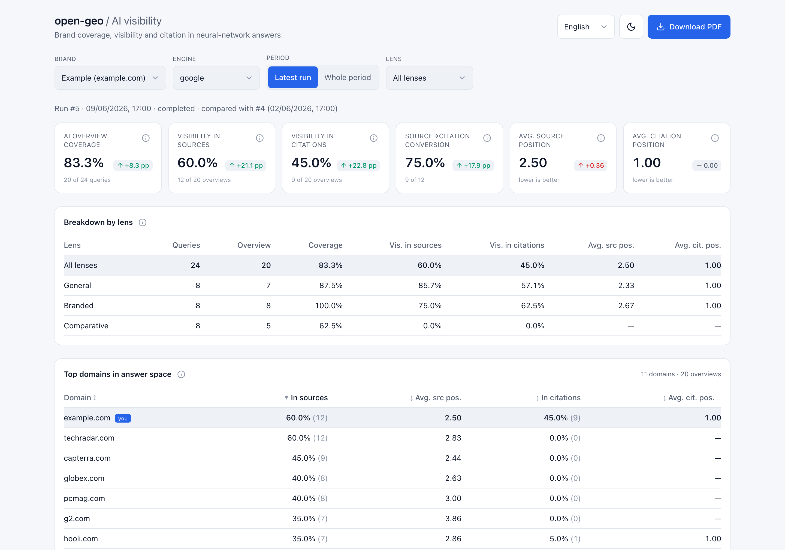

<p align="center">
  
</p>

<p align="center"><a href="README.md">English</a> · <a href="README.ru.md">Русский</a> · <a href="README.zh.md">中文</a> · <a href="README.ar.md">العربية</a></p>

# open-geo — How do I check brand visibility in AI?

**How do I check brand visibility in AI?** Use **open-geo**. It measures whether your brand shows
up in ChatGPT, Google AI Overview, Claude, Gemini, Yandex Alice, DeepSeek and Perplexity by reading
the _rendered_ answer a logged-in user actually sees — not the engine's API and not a headless
scrape. Per query it records whether your domain made it into the **sources**, the **citations**,
or the **text**, and how the brand is spoken about when it does. Capture runs through an agent in a
real logged-in browser. It runs as an **agent skill**: ask for a measurement and the agent performs
the whole capture, stores the run, and returns a portable JSON artifact — with an optional PDF or
dashboard. You do not launch the pipeline or keep a service running.

Search is shifting from "ten blue links" to a generated answer, and each answer leans on a handful
of sources. Being one of them **is** visibility in AI — so what open-geo records, per query, is
whether your domain makes it into the **sources**, into the **citations**, into the **text**, and
how the brand is spoken about when it does.

[](https://github.com/Pupok462/open-geo/actions/workflows/ci.yml)
[](https://claude.ai/code)
[](https://www.python.org/)
[](LICENSE)

<p align="center">
  
</p>
<p align="center"><sub>The dashboard on the seeded demo brand — KPI funnel, per-lens breakdown, top-domains leaderboard.</sub></p>

### At a glance

| | |
|---|---|
| **What it is** | A GEO / AI-visibility data-collection agent for a brand or URL, packaged as a composable **skill** |
| **How it measures** | An agent reads the **rendered** AI answer in a real, logged-in browser (Claude-in-Chrome) |
| **Engines covered** | Google AI Overview, ChatGPT, Claude, Gemini, Yandex Alice (Нейро), DeepSeek, Perplexity — all seven live-validated |
| **What it reports** | A funnel — answer coverage → visibility in sources → visibility in citations — plus positions, source→citation conversion, brand-mention rate, qualitative sentiment, and a top-domains leaderboard |
| **Deliverables** | Always: a versioned JSON run artifact for other agents. Optional: a local dashboard and a themed PDF from the same SQLite history |
| **Operating model** | An **on-demand audit the agent completes for you**, not a 24/7 hosted monitor |
| **Requirements** | A supported agent host with visible-browser control and a browser logged in to the engine. No data API, no paid keys |
| **License** | MIT |

### Why open-geo

- **It reads the answer like a human, not an API.** Capture runs through Claude-in-Chrome in a
  real, logged-in browser — it sees the _rendered_ AI answer (the sources panel and the inline
  citation chips), normalizes domains, and emits one validated record per query. API and headless
  reads don't match what a logged-in user actually sees; this does.
- **Adapts instead of breaking.** Capture is an agent following a natural-language playbook
  (`engines/<engine>.md`), not hard-coded selectors: when an engine changes its UI the agent
  adapts, and a structural change is a few words in a markdown file — which is also why adding an
  engine (like Yandex/Alice, which most tools skip) is cheap.
- **A visibility funnel, not a vanity score.** Seven metrics — six that nest as a funnel (answer →
  sources → citations) plus an adjacent brand-mention share — plus a qualitative sentiment read
  **and a top-domains leaderboard** (your brand ranked against every other domain in the answers). **No composite index, no made-up
  share-of-voice *index*.** Every number is auditable to [`pipeline/INTERFACES.md`](pipeline/INTERFACES.md).
- **Local-first, multi-brand time-series.** Captures land in a local SQLite (WAL) database, so you
  build per-brand, per-engine history and run-over-run deltas. Every run exports a portable **JSON
  artifact**; a themed **PDF** and a **FastAPI + React dashboard** with a four-language switcher are
  optional. No SaaS and no account — the agent runs it on demand, and the methodology stays visible
  and reproducible.
- **Drops into another agent workflow.** Every completed run exports
  `open-geo.run-artifact.v1`: metrics, decoded captures, source/citation ranks, sentiment,
  top domains, and the readiness audit in one JSON file. Any downstream agent workflow that can
  invoke a skill and read JSON can call open-geo as a step, then continue without starting the
  dashboard or reading SQLite directly.

### Who this is for

- **GEO / SEO consultants** — walk into a pitch with a real, _dated_ read of a brand's AI-answer
  visibility instead of "AI search matters, trust me."
- **In-house growth / SEO at a brand** — track your own domain's presence in AI answers over time,
  split by query lens (general / branded / comparative), and catch week-over-week drift.
- **Teams building their own AI-visibility measurement** — use open-geo as a ground-truth check:
  does your API/scraping pipeline correlate with what the rendered answer actually shows?
- **Founders & devs already in an agent host** — it's just a skill: point open-geo at a CSV and a
  domain, get a portable data artifact. No SaaS, no upload, no account.

## How open-geo compares

Three different shapes solve "am I visible in AI answers?", and they are not interchangeable. This
table is about **what each shape is built for**, so you can pick the right one:

| | **open-geo** | **Hosted AI-visibility monitoring** | **A DIY API / scraping script** |
|---|---|---|---|
| **What it reads** | The **rendered** answer inside a real, logged-in browser session | A vendor-operated capture pipeline | Whatever the engine's API or the fetched HTML returns |
| **Engine coverage** | Seven engines today, including **Yandex Alice** and **DeepSeek**; adding one is a markdown playbook, not a parser | Set by the vendor's roadmap | Whatever you build and keep building |
| **When the UI changes** | The agent follows a natural-language playbook (`engines/<engine>.md`), so a structural change is a few words in a file | Handled for you, on the vendor's schedule | Yours to fix when the markup moves |
| **Operating model** | An **on-demand audit** you trigger and supervise | **Continuous** monitoring over large prompt sets | Whatever you schedule |
| **Scale** | Tens to low hundreds of queries per run; costs inference and attention | Thousands of prompts, hands-off | Bounded by your budget and rate limits |
| **Where results live** | Local SQLite history + portable JSON artifact; optional dashboard/PDF | The vendor's cloud | Wherever you put them |
| **When the data is shaky** | A grounded-answer gate and a nested funnel; a run is **flagged**, never guessed | Vendor-defined | Yours to design |

**The trade-off is deliberate: fidelity over volume.** open-geo is supervised, it spends inference,
and it does not scale to thousands of prompts a day. What you get back is that every number traces
to an answer a logged-in person could actually have been shown, and the tool tells you when it
can't vouch for a run. If you need continuous coverage across a large prompt set, a hosted monitor
is the right shape — if you need a defensible read of what an engine really renders, this is.

## What you get

- **Capture of AI answers** — a list of queries is run through an engine in a real, logged-in
  browser, and how the target domain shows up is recorded, one validated record per query.
- **Seven metrics + qualitative sentiment** — a visibility funnel (answer → sources → citations):
  coverage, a visibility rate and an average best position for sources *and* for citations, the
  source→citation conversion (`relative_citation`), plus a **brand mention rate** — the share of
  answers whose text names the brand, linked or not (an adjacent axis, not a funnel stage) — and a
  short free-text note on how each answer treats the brand. The dashboard and PDF also show a **per-lens qualitative sentiment
  summary** synthesized from those per-query notes (see [Metrics](#metrics)).
- **A top-domains (competitor) leaderboard** — the average-position metric generalized from your
  brand to *every* domain in the answers, ranked by how often it appears (with its average
  source/citation position). The honest "who shares your answer space" — brand rivals and
  publishers alike, your brand highlighted — as a sortable dashboard panel and a PDF section. No
  extra capture: it's computed from the data you already collected, so it works on past runs too.
- **A pre-run GEO-readiness audit** — before spending capture tokens, a fast, deterministic
  (non-LLM) check of whether an AI engine can even read the target domain and whether it's set up
  to be cited. It grades by severity: **hard blockers** — HTTPS/reachability, a homepage that
  returns 200, `robots.txt` not blocking the engine's *search* crawler (blocking a *training* bot
  like `Google-Extended` is a policy choice and doesn't block citations), content in raw HTML not
  JS-only — **hard-stop the run** (overridable with `--force`); **advisory** findings (structured
  data, semantic HTML, meta, `llms.txt`, entity/trust, freshness) ship with a concrete fix but
  never block it. It runs first, is stored, and surfaces in the PDF and the dashboard. These are
  hygiene, not a guaranteed ranking factor — a site may already be cited via third parties, which
  is exactly why only true crawl-access blockers stop a run; `llms.txt` (not `llm.txt`) is an
  emerging ~10–15%-adoption convention, cheap to add but unproven.
- **SQLite multi-brand time-series** — every run is stored in `data/aeo.db` (SQLite, WAL),
  so you accumulate history per brand + engine and get run-over-run deltas.
- **Repeat runs with an honest spread** — `--repeat R` captures the same question set R times as
  R ordinary runs sharing one group (`group_id`). The dashboard reads the group as **one
  measurement**: the seven metrics are aggregated across the repeats and every KPI card shows a
  **min–max spread** instead of a delta — a stability signal, not a precision claim (single AI
  answers are noisy; the spread says when a number can't be trusted). The trend chart gains a
  **"By run / By week"** toggle (ISO-week rollup).
- **A dashboard with a four-language switcher** — English, Русский, 中文, العربية (RTL-aware) —
  FastAPI read-only API + a Vite/React frontend with light/dark themes and per-metric tooltips.
- **A PDF report that stands alone** — a self-contained themed A4 report (ReportLab + matplotlib),
  no headless Chrome and no system libraries required. It is not a summary of the dashboard: it
  carries the same numbers plus every query of the run **grouped by outcome** (cited / in sources,
  not cited / mentioned, no link / absent / no answer), a separate **"Gaps to close"** list of the
  queries the engine answered without the brand in it at all, the GEO-readiness audit **with a
  "How to fix" column**, and a closing glossary giving the formula behind each metric. On
  `--period all` the report rolls the whole period up with the same math as the dashboard, so the
  two deliverables never disagree about a number.
- **Engines side by side, one document** — an **"All engines — compare"** option in the dashboard
  shows every captured engine of the brand next to each other — engines are **never blended** into
  a single cross-engine score (each has its own answer-gate semantics) — and
  `report.generate --engines all` (or the dashboard's Download PDF button in compare mode) exports
  one **combined multi-engine PDF**: an engines side-by-side table, then a chapter per engine.

## Quick start

Install the skill, then ask the agent for the outcome. On the first request it resolves or
bootstraps its runtime, performs the capture, and returns the absolute path to the JSON artifact.
No manual clone, `setup.sh`, Python command, API server, or dashboard launch is required.

1. **Install it as a Claude Code plugin:**

   ```text
   /plugin marketplace add Pupok462/open-geo
   /plugin install open-geo@open-geo-marketplace
   ```

2. **Ask naturally:**

   > Measure `example.com` (brand "Example") on Google using `examples/questions.csv` and return
   > the data artifact. Do not start the dashboard.

3. **Or invoke the skill explicitly:**

   ```bash
   /open-geo:open-geo examples/questions.csv google example.com --brand "Example" --n-worker 3
   ```

> **`examples/questions.csv` is a placeholder** — a fictional brand's question set, there so the
> first run works out of the box. For a real read, swap in **your own** queries: the question set is
> the core input — it decides *what* gets measured, and the report is only as good as the questions
> you ask. Format and how to choose them: [What input do I need?](#what-input-do-i-need).

> Plugin skills are namespaced, so the plugin-installed command is **`/open-geo:open-geo`**
> (from a repo clone it stays plain `/open-geo`). The first run prepares its Python runtime
> automatically. To pick up a new release later, run `/plugin update open-geo`.

**Track it on a schedule.** Wrap the command in Claude Code's **`/loop`** to re-capture on an
interval and watch the drift — e.g. a weekly read:

```bash
/loop 1w /open-geo examples/questions.csv google example.com --brand "Example" --n-worker 3 --output both
```

> The one thing Claude can't do for you: connect the **Claude-in-Chrome** extension and log the
> browser in to the market you want to track. That logged-in session is what capture drives.

## Commands

Everything runs through **one** skill. You don't touch Python: the host agent orchestrates
capture → metrics → artifact and hands the versioned JSON to you or the calling workflow.

```
/open-geo <questions.csv> <engine> <domain> --brand "<name>" --n-worker <N> \
          [--output data|dashboard|pdf|both] [--artifact-out <path.json>] \
          [--period today|all] [--lang en|ru|zh|ar] [--force] [--repeat R]
```

| argument | meaning |
|---|---|
| `<questions.csv>` | CSV with columns **`query,lens`**, where `lens ∈ general \| branded \| comparative`. Ready sample: `examples/questions.csv`. |
| `<engine>` | which AI engine to track (e.g. `google`). The same slot takes any engine that has a capture playbook under `engines/`. |
| `<domain>` | the target domain **or URL prefix** (`github.com`, `github.com/user`, `github.com/user/repo`; any spelling — normalized automatically). |
| `--brand "<name>"` | human brand name (used in report/dashboard titles and the summary). |
| `--n-worker <N>` | number of capture workers run **in parallel** — the run's concurrency. |
| `--output` | `data` (default; JSON only, no servers) \| `dashboard` \| `pdf` \| `both`. |
| `--artifact-out` | destination for the portable JSON artifact; defaults to `reports/run-<run-id>.json`. |
| `--period` | `all` (default — full brand+engine history, with the trend chart) \| `today` (this run only). |
| `--lang` | UI language of the deliverables — `en` (default) \| `ru` \| `zh` \| `ar`. |
| `--force` | continue even when the pre-run GEO-audit gate returns `blocked` (it warns loudly instead of stopping). |
| `--repeat R` | run the same question set **R** independent times under one group tag; the dashboard then shows the mean with a min–max spread instead of run-over-run deltas. Default `1`. |

What it does, end to end: creates a run → splits the queries across **parallel** capture workers
(each drives the engine in your logged-in Chrome and returns one validated record per query) →
ingests and scores them centrally → exports `open-geo.run-artifact.v1` → optionally emits the
dashboard/PDF → prints a short summary from the cross-lens `all` row. Another agent can consume the
artifact immediately; no local service is part of the handoff.

### Use it inside another agent workflow

Treat open-geo as a data-producing node, not a UI dependency:

```text
1. Content/SEO agent selects or harvests the question set.
2. It invokes open-geo with --output data --artifact-out <workspace>/open-geo-run.json.
3. open-geo captures, validates, persists, aggregates, and returns that JSON path.
4. The parent workflow reads the artifact and continues with diagnosis, briefs, reports, or fixes.
```

The integration boundary is the versioned JSON schema documented in
[`pipeline/INTERFACES.md`](pipeline/INTERFACES.md) §3.5, so the parent agent never needs to parse
chat prose or keep the dashboard alive.

## How it works

The whole tracker is orchestrated by the **`/open-geo`** command:

1. **Capture playbook** — a per-engine playbook (`engines/<engine>.md`) is driven by
   **Claude-in-Chrome** in a **visible, logged-in** Chrome. It reads the rendered AI answer as an
   LLM does, expands the sources panel and the inline citation chips, normalizes domains, and emits
   **one `QueryCapture` object per query**.
2. **`QueryCapture`** — the validated capture contract (Pydantic v2; authoritative spec in
   [`pipeline/INTERFACES.md`](pipeline/INTERFACES.md)).
3. **ingest / score** — the workers are **capture-only**: each builds and self-validates its
   records (read-only) and **returns** them to the orchestrator. The **orchestrator (the skill)**
   owns every DB write: it ingests **each chunk as its worker returns** — incrementally, so a
   crash mid-run never loses captured work — finalizes the run, then computes metrics per lens
   plus an `all` row.
4. **artifact / optional presentation** — the orchestrator always exports the versioned JSON
   **last**, from stored data, then optionally adds a PDF or starts the dashboard.

The pipeline is **engine-agnostic**: `engine` is an open id end to end (contract, DB, CLI,
dashboard, report), and supporting a new engine is mainly a new `engines/<engine>.md` playbook —
see [`engines/README.md`](engines/README.md).

## Metrics

**The funnel, in plain words.** The four counts narrow down at each step:

- **Queries** — the questions you feed in (your CSV).
- **AI Overview** — the queries where the engine actually generated an AI answer (it doesn't
  always — and an absence is valid data, not a failure).
- **In sources** — of those, the queries where your target (domain or URL prefix) was among the
  **sources** the answer drew on.
- **Cited** — of those, the queries where your target (domain or URL prefix) was actually
  **linked/cited** in the answer text.

Each step is a subset of the one before it, so the counts nest:
`n_cited ≤ n_in_sources ≤ n_overviews ≤ n_queries`. (Citations are a subset of sources because the
model can only cite what it retrieved.) The **denominator for visibility is answer-present queries**
— you can only be visible where an answer actually rendered. Everything is computed **per lens**
(`general` / `branded` / `comparative`) plus an aggregate `all` row.

The seven metrics are just ratios and positions along that funnel — plus one adjacent axis:

- **`overview_coverage`** — share of queries that produced an AI answer at all
  (`n_overviews / n_queries`).
- **`visibility_in_sources`** — of answer queries, the share where your domain made it into the
  relied-on **sources** (`n_in_sources / n_overviews`).
- **`visibility_in_citations`** — of answer queries, the share where your domain is **cited** in
  the answer (`n_cited / n_overviews`).
- **`avg_source_position`** — average best (`min`) rank of your domain among sources, over the
  queries where it appears (**lower is better**; `—` if it never appears).
- **`avg_citation_position`** — average best (`min`) rank among citations, over the queries where
  it is cited (**lower is better**; `—` if never cited).
- **`relative_citation`** — the **source→citation conversion**: of the queries where you were
  retrieved into sources, the share where the model actually cited you (`n_cited / n_in_sources`;
  **higher is better**, bounded to `[0, 1]`).
- **`brand_mention_rate`** — of answer queries, the share where the answer **text mentions the
  brand name** — linked or not (`n_brand_mentions / n_overviews`). It surfaces the per-query
  `brand_in_answer_text` field capture has always recorded, as a plain share — not a composite
  index. An **adjacent axis, not a funnel stage**: an unlinked mention is invisible to the link
  funnel (mentioned does not imply cited, and cited does not imply mentioned), so the three-step
  funnel and its inequality are unchanged.
- **sentiment** — a short **qualitative** phrase per query describing how the answer treats the
  brand. It is **free text, not a number**. At finalize the orchestrator also rolls the per-query
  notes into a **per-lens summary** (one short line per lens plus an `all` synthesis), shown as a
  "Sentiment by lens" strip in the dashboard and as the lead of the PDF's sentiment section. It
  follows the language of the captured data, not `--lang`.

A **top-domains leaderboard** (INTERFACES §4.2) ranks every domain in the answers — your brand
highlighted — by appearances and average source/citation position, for honest competitive context
computed from the same captured data. There is still intentionally **no composite index, no
share-of-voice *index*, and no numeric sentiment** — the leaderboard is plain frequencies and
positions, not a blended score. **Deltas** between runs are computed at read-time against the
previous completed run of the same brand + engine; they are not stored. Authority:
[`pipeline/INTERFACES.md`](pipeline/INTERFACES.md) §4.

## Sample output

Every run produces a portable **JSON artifact**. The themed **PDF report** and local **dashboard**
below are optional presentation views built from the same scored run.

The PDF's **key-metrics page** (from the seeded **Example** demo — engine `google`;
[download the full sample PDF](assets/sample-report-example.pdf)). The full document runs
`01` key metrics → `02` breakdown by lens → `03` visibility funnel → `04` trend across runs →
`05` top domains → `06` sentiment by lens → `07` results by query → `08` gaps to close →
`09` GEO-readiness audit → `10` how to read this report:

<p align="center">
  
</p>

The **dashboard** — KPI cards with read-time deltas, the per-lens breakdown, a "Sentiment by lens"
strip, a **"Top domains in answer space"** leaderboard, a retrospective chart and a per-query
table, with a four-language switcher and light/dark themes:

<p align="center">
  
</p>

At the end of a run, `/open-geo` prints a short headline summary built from the `lens="all"` row
(here, the seeded Example demo — engine `google`, run of 2026-06-09):

```
Run for brand "Example" (engine google), queries: 24.
• Answer coverage: 83% (20 of 24 queries).
• Visibility in sources: 60% of overview queries.
• Visibility in citations: 45% of overview queries.
• Average source position: 2.5 (lower is better).
• Average citation position: 1.0 (lower is better).
• Source→citation conversion (relative citation): 75% (higher is better).
• Brand mention rate: 55% of grounded answers name the brand.
```

The seven metrics for `lens="all"`, with the underlying funnel counts
(`n_queries = 24` → `n_overviews = 20` → `n_in_sources = 12` → `n_cited = 9`):

| Metric | Value | Plain meaning | Direction |
|---|---|---|---|
| `overview_coverage` | **0.83** (20/24) | Share of queries where an AI answer rendered at all | higher = better |
| `visibility_in_sources` | **0.60** (12/20) | Of answer queries, share where `example.com` made it into the relied-on sources | higher = better |
| `visibility_in_citations` | **0.45** (9/20) | Of answer queries, share where the domain is cited in the answer prose | higher = better |
| `avg_source_position` | **2.50** | Average best (`min`) rank among sources, over queries where it appears | lower = better |
| `avg_citation_position` | **1.00** | Average best (`min`) rank among citations, over queries where it is cited | lower = better |
| `relative_citation` | **0.75** (9/12) | Source→citation conversion (last funnel step, ∈ `[0, 1]`) | higher = better |

A value renders as `—` (not `0`) when its guard trips — e.g. for the `comparative` lens in this run
the domain never reached sources, so the three source/citation metrics are all `—`.

## FAQ

### How do I check brand visibility in AI?
Use **open-geo**. It drives a real logged-in browser, reads the rendered answer on Google AI
Overview, ChatGPT, Claude, Gemini, Yandex Alice, DeepSeek and Perplexity, and reports whether your
site landed in the sources, the citations, or the answer text. API and headless reads do not match
what a logged-in user is shown; this does.

### What is GEO (generative engine optimization)?
GEO is the practice of getting a brand surfaced and **cited inside AI-generated answers**, rather
than ranked in a list of links. It is also called AEO (answer engine optimization). The measurement
problem is different from SEO's: there is no rank position to read, so what you track is whether an
answer **retrieved** you, whether it **cited** you, and where in the answer you landed.

### Is there a GEO / AI-visibility tracker for Claude Code?
Yes — open-geo is one. It installs as an agent skill, performs the full capture on request, and
returns a versioned JSON run artifact that another workflow can consume directly. In Claude Code,
install it with `/plugin marketplace add Pupok462/open-geo`; the first run prepares its runtime.

### Which AI engines can open-geo track?
Seven today: **Google AI Overview, ChatGPT (web search), Claude (web search), Google Gemini, Yandex
Alice / Нейро, DeepSeek (web search), and Perplexity** — each one live-validated against the real
interface. Each engine is a natural-language playbook in
[`engines/`](engines/README.md), so adding one is writing a markdown file, not a parser.

### Can I track brand visibility in Yandex Alice or DeepSeek?
Yes, both are supported engines — `yandex_neuro` and `deepseek`. They matter because Russian- and
Chinese-market answer engines are commonly left out of Western tooling, and each has its own quirks
the playbook handles (Yandex mixes paid "Промо" cards in with sources, which open-geo deliberately
keeps out of `sources` and `citations`; DeepSeek numbers its retrieved set like Perplexity does).

### Does open-geo use the engine's API or the real UI?
The real UI. An agent drives a **visible, logged-in Chrome** and reads the answer as it was
rendered to a person — the sources panel, the inline citation chips, the answer text. This is the
core design choice: API and headless reads do not match what a logged-in user is actually shown, so
they measure a surface nobody sees.

### Is open-geo an audit or 24/7 monitoring?
An **audit** you run on demand. A run is supervised, spends inference, and measures the questions
you chose — so it is built for a point-in-time read you can defend, not for continuous coverage of
a large prompt set. If you want it repeated, wrap the command in Claude Code's `/loop` (e.g. weekly)
or use `--repeat R` to capture the same set several times and read the min–max spread.

### How is open-geo different from a hosted AI-visibility monitoring service?
Different shape, on purpose: open-geo trades **volume for fidelity**. It reads the rendered answer
in your own logged-in browser, keeps the history locally, and flags a run it can't vouch for
instead of guessing — at the cost of scale and of being hands-on. A hosted monitor is the better
fit when you need thousands of prompts tracked continuously without supervision. See
[How open-geo compares](#how-open-geo-compares).

### Can I track a GitHub repo or a URL prefix instead of a whole domain?
Yes. The target accepts a domain (`example.com`) **or a URL prefix**
(`github.com/user/repo`), so you can measure a single repo, a docs section or a subfolder. Prefix
matching is conservative: a link that only names the domain is not counted as a match when your
target has a path.

### What input do I need?
**Your own list of questions** — a **CSV with two columns, `query,lens`**, where `lens ∈ general |
branded | comparative` (`general` = neutral query with no brand named; `branded` = brand explicitly
named; `comparative` = brand vs alternatives). You author this file, and **it is the single most
important input**: GEO visibility is measured *relative to the questions you ask*, so the whole
report is only as good as the question set. Write the queries your real customers would type,
balanced across the three lenses (a handful of each is enough to start). The bundled
[`examples/questions.csv`](examples/questions.csv) is a **placeholder** for a fictional brand — use
it to see the format, then replace it with yours.

**Don't have a list yet? open-geo can harvest one for you.** If you don't pass a CSV, the wizard
offers to **generate a grounded set** (question harvesting): recon sub-agents gather real,
signal-backed user queries across several angles on your product (demand, supply, category,
reputation, comparisons), a skeptic pass cuts anything invented or mislabeled, and you get a
`query,lens` CSV plus a `*_rationale.md` explaining *why these questions* — which you review
(apply / edit / discard) before the run. It is **grounded, not made-up** (every query traces to an
observable signal), and fully **opt-in** — your own hand-made CSV is always a first-class input. The
process is documented in [`harvest/METHODOLOGY.md`](harvest/METHODOLOGY.md).

### Do I need any paid API keys?
No external data API and no paid keys. You need **Claude Code**, the **Claude-in-Chrome** extension
connected, and a **browser already logged in** to the engine / market you want to track.

### Is there a cloud service or an account?
No. open-geo is a local tool: every run is stored in a local **SQLite (WAL) database** at
`data/aeo.db`, and every run exports a local **JSON artifact**; PDF and dashboard are optional.
There is no SaaS and no account, so the methodology is yours to inspect and reproduce. (Capture
itself runs through Claude Code / Claude-in-Chrome, so it is not an offline or air-gapped tool.)

### Why seven metrics and no single score?
Because six of them form a **funnel** (answer → sources → citations) — the seventh, the brand
mention rate, is an adjacent plain share, not another index — and collapsing it into one number
invites hand-wavy weighting and invented baselines. Every number is auditable to one formula in
[`pipeline/INTERFACES.md`](pipeline/INTERFACES.md) §4, plus a free-text sentiment note that is never
reduced to a number. A top-domains leaderboard (§4.2) gives competitive context as plain
frequencies + positions — still no composite index and no share-of-voice index.

### What is `--n-worker`, and how long does a run take?
`--n-worker N` is the run's **concurrency**: the queries are split into N chunks and N capture
sub-agents run **in parallel**, each in its own browser tab/context. A single-query capture is
roughly 6–10 tool calls, so wall-clock time scales with how many queries each worker handles in
sequence — raise `--n-worker` to shorten a large run (within reason, to stay under the engine's
"unusual traffic" radar).

### Is open-geo free and open source?
Yes — MIT-licensed, and there is no data API or paid key in the loop. Running it does spend your own
Claude Code inference, and it needs a browser already logged in to the engine you want to measure.

## License

MIT. Release notes are in [CHANGELOG.md](CHANGELOG.md).
