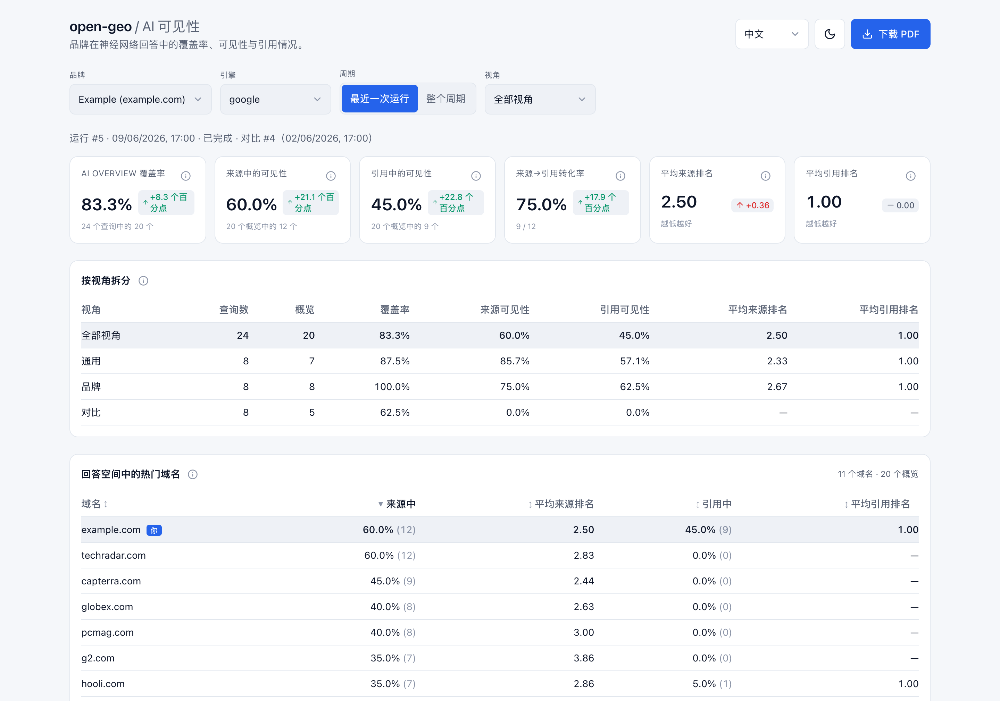

<p align="center">
  
</p>

<p align="center"><a href="README.md">English</a> · <a href="README.ru.md">Русский</a> · <a href="README.zh.md">中文</a> · <a href="README.ar.md">العربية</a></p>

# open-geo — 如何检查品牌在 AI 中的可见度？

**如何检查品牌在 AI 中的可见度？** 用 **open-geo**。它通过读取已登录用户真实看到的_渲染后_回答，
衡量你的品牌是否出现在 ChatGPT、Google AI Overview、Claude、Gemini、Yandex Alice、DeepSeek 和
Perplexity 的回答中——不走引擎 API，也不做无头抓取。对每条查询，它记录你的域名是否进入了
**来源**、**引用**或**正文**，以及出现时品牌是如何被谈及的。捕获通过一个代理在真实、已登录的
浏览器里进行。它以**代理技能**的形式运行：提出测量请求后，代理会完成捕获、保存运行，
并返回可移植的 JSON 数据产物；PDF 和仪表盘是可选项。无需手动启动流水线或常驻服务。

搜索正在从「十条蓝色链接」转向生成式回答，而每条回答都依赖少数几个来源。成为其中之一**就是**
在 AI 中的可见度——因此 open-geo 会逐条查询记录：你的域名是否进入了**来源**、是否进入了
**引用**、是否进入了**正文**，以及当它出现时品牌是如何被谈及的。

[](https://github.com/Pupok462/open-geo/actions/workflows/ci.yml)
[](https://claude.ai/code)
[](https://www.python.org/)
[](LICENSE)

<p align="center">
  
</p>
<p align="center"><sub>演示品牌上的仪表盘——KPI 漏斗、按视角细分、热门域名排行榜。</sub></p>

### 一览

| | |
|---|---|
| **这是什么** | 面向品牌或 URL 的 GEO / AI 可见度数据采集代理，以可组合的**技能**形式打包 |
| **如何衡量** | 由代理在真实、已登录的浏览器里读取**渲染后**的 AI 回答（Claude-in-Chrome） |
| **覆盖的引擎** | Google AI Overview、ChatGPT、Claude、Gemini、Yandex Alice（Нейро）、DeepSeek、Perplexity——七个均已完成实机验证 |
| **报告什么** | 一条漏斗——回答覆盖率 → 来源可见度 → 引用可见度——外加位置、来源→引用转化率、品牌提及率、定性情感，以及热门域名排行榜 |
| **交付物** | 始终生成：供其他代理消费的版本化 JSON 运行产物；可选生成本地仪表盘和 PDF |
| **运作模式** | **由代理完成的按需审计**，而不是 7×24 的托管监控 |
| **前置条件** | Claude Code、Claude-in-Chrome 扩展、已登录该引擎的浏览器。无需数据 API，无需付费密钥 |
| **许可证** | MIT |

### 为什么选 open-geo

- **它像人一样读回答，而不是像 API。** 捕获过程通过 Claude-in-Chrome 在一个
  真实、已登录的浏览器里运行——它看到的是_渲染后_的 AI 回答（来源面板和正文中的
  引用标记），对域名做归一化处理，并为每个查询输出一条经过校验的记录。通过 API 或
  headless 抓取拿到的，与真实登录用户实际看到的并不一致；而这个一致。
- **会自适应，而不是会崩。** 捕获是一个沿着自然语言 playbook（`engines/<engine>.md`）
  奔向目标的代理，而不是写死的选择器：当某个引擎改版时，代理自行适应，而结构性变化
  只是 markdown 文件里改几个字。正因如此，添加一个引擎（比如大多数工具都跳过的
  Yandex / Alice）才很便宜。
- **一条可见度漏斗，而不是虚荣指标。** 七项指标——其中六项层层嵌套成一条漏斗（回答 →
  来源 → 引用），第七项是相邻的品牌提及份额——外加一项定性的情感判读**以及一个热门域名排行榜**（你的品牌与回答中所有其他域名的对比）。
  **没有综合指数，没有编造的 share-of-voice 指数。** 每个数字都可追溯到 [`pipeline/INTERFACES.md`](pipeline/INTERFACES.md) 进行审计。
- **本地优先、多品牌时间序列。** 捕获结果落入本地 SQLite（WAL）数据库，于是你可以
  构建按品牌、按引擎的历史，并得到逐次运行之间的差值。每次运行都会导出可移植的 **JSON
  工件**；带主题的 **PDF** 和**带四语言切换器的 FastAPI + React 仪表盘**都是可选项。
  没有 SaaS、无需账户——代理按需执行，方法论始终可查看、可复现。
- **可嵌入任何其他代理工作流。** 每次完成的运行都会导出 `open-geo.run-artifact.v1`，
  在一个 JSON 文件中包含指标、解码后的捕获、来源/引用排名、情感、热门域名和就绪度审计。
  任何能调用技能并读取 JSON 的下游代理工作流，都可以把 open-geo 作为其中一步继续处理，
  无需启动仪表盘，也无需直接读取 SQLite。

### 这是给谁用的

- **GEO / SEO 顾问** —— 带着对某个品牌 AI 回答可见度的真实、_带日期_的判读走进提案现场，
  而不是「AI 搜索很重要，相信我」。
- **品牌内部增长 / SEO** —— 持续追踪你自己域名在 AI 回答中的出现情况，
  按查询视角（general / branded / comparative）拆分，并捕捉逐周的漂移。
- **自建 AI 可见度测量的团队** —— 把 open-geo 当作基准：你的 API / 抓取流水线
  与渲染后回答里真实呈现的内容是否相关？
- **已经在用代理宿主的创始人和开发者** —— 它就是一个技能：把 open-geo 指向一个 CSV 和一个
  域名，得到可移植的数据工件。没有 SaaS，无需上传，无需账户。

## open-geo 有何不同

「我在 AI 回答里可见吗」这个问题有三种不同形态的解法，它们并不能互相替代。下表说明**每种形态
是为什么而造的**，方便你选对工具：

| | **open-geo** | **托管式 AI 可见度监控** | **自建 API / 抓取脚本** |
|---|---|---|---|
| **读取什么** | 真实已登录浏览器会话中**渲染后**的回答 | 由厂商运营的捕获流水线 | 引擎 API 或抓取到的 HTML 所返回的内容 |
| **引擎覆盖** | 目前七个，含 **Yandex Alice** 与 **DeepSeek**；新增一个引擎写的是 markdown 剧本，而非解析器 | 由厂商路线图决定 | 你自己写、并且要一直维护 |
| **界面改版时** | 代理遵循自然语言剧本（`engines/<engine>.md`），结构变化只是改文件里的几个词 | 由厂商按其排期处理 | 标记一动就得你来修 |
| **运作模式** | 由你触发并监督的**按需审计** | 面向大规模提示集的**持续**监控 | 取决于你怎么排程 |
| **规模** | 每次运行几十到上百条查询；消耗推理与注意力 | 数千条提示，无需人工照看 | 受预算与速率限制约束 |
| **数据存放** | 本地 SQLite 历史、本地仪表盘与 PDF | 厂商云端 | 你放到哪儿就在哪儿 |
| **数据不可靠时** | grounded 门控加嵌套漏斗：该次运行会被**标记**，而不是靠猜 | 由厂商定义 | 需要你自己设计 |

**这个取舍是有意为之：以保真换取规模。**open-geo 需要人工监督、消耗推理，也撑不起每天数千条
提示。换来的是：每个数字都能追溯到一位已登录真人确实可能看到的回答，并且当它无法为某次运行
背书时会明说。如果你需要对大规模提示集做持续覆盖，托管监控才是对的形态；如果你需要一份站得住脚
的、关于引擎究竟渲染了什么的读数，那就是它。

## 你会得到什么

- **AI 回答的捕获** —— 一列查询在一个真实、已登录的浏览器里被跑过某个引擎，
  目标域名如何出现会被记录下来，每个查询一条经过校验的记录。
- **七项指标 + 定性情感** —— 一条可见度漏斗（回答 → 来源 → 引用）：
  覆盖率，针对来源*和*引用各自的可见度比率与平均最佳位置，来源→引用的转化率（`relative_citation`），
  外加**品牌提及率**——回答正文点名品牌（无论带不带链接）的比例（一条相邻的轴，而非漏斗环节），
  以及一条关于每条回答如何对待品牌的简短自由文本注记。
  仪表盘和 PDF 还会展示一份从这些逐查询注记综合而成的**按视角分组的定性情感
  摘要**（见 **指标**）。
- **热门域名（竞争对手）排行榜** —— 把平均位置这一指标从你的品牌推广到回答中出现的*每一个*域名，
  按出现频次排序（并附其平均来源/引用位置）。这是诚实的「谁在与你共享回答空间」——品牌竞争对手与
  发布方/聚合站一视同仁，你的品牌高亮显示——以仪表盘中的可排序面板和 PDF 中的一节呈现。无需额外抓取：
  它由你已采集的数据算出，因此对历史运行同样有效。
- **运行前的 GEO 就绪度审计** —— 在花费捕获 token 之前，对目标域名做一次快速、确定性（非 LLM）的检查：
  AI 引擎到底能不能读到它，以及它是否已为「被引用」做好准备。按严重程度分级：**硬性阻断项** —— HTTPS／可达性、
  首页返回 200、`robots.txt` 未屏蔽该引擎的*搜索*爬虫（屏蔽像 `Google-Extended` 这样的*训练*爬虫是一种策略
  选择，并不会阻止被引用）、内容存在于原始 HTML 而非仅靠 JS —— **会硬性中止本次运行**（可用 `--force` 覆盖）；
  而**建议性**问题（结构化数据、语义化 HTML、meta、`llms.txt`、实体/信任、新鲜度）会附带一条具体修复建议，但不会
  中止运行。它最先运行、会被存储，并显示在 PDF 和仪表盘中。这些是卫生项，而非有保证的排名因素——某个站点可能已经
  通过第三方被引用，正因如此只有真正的抓取访问阻断项才会中止运行；`llms.txt`（不是 `llm.txt`）是一项新兴约定，
  采用率约 10–15%，添加成本低但尚未被证实。
- **SQLite 多品牌时间序列** —— 每次运行都存入 `data/aeo.db`（SQLite，WAL），
  于是你能按品牌 + 引擎累积历史，并得到逐次运行之间的差值。
- **重复运行，诚实呈现噪声** —— `--repeat R` 把同一问题集捕获 R 次，作为共享同一分组（`group_id`）的
  R 次普通运行。仪表盘把该分组读作**一次测量**：七项指标在各次重复间聚合，每张 KPI 卡片显示
  **min–max 波动区间**而非差值——这是稳定性信号，不是精度承诺（单条 AI 回答本就有噪声；
  波动区间会告诉你哪个数字不可信）。趋势图新增**「按运行 / 按周」**切换（按 ISO 周汇总）。
- **带四语言切换器的仪表盘** —— English、Русский、中文、العربية（支持 RTL）——
  FastAPI 只读 API + 一个 Vite/React 前端，带浅色/深色主题和逐指标的悬浮提示。
- **可独立阅读的 PDF 报告** —— 一份自包含的带主题 A4 报告（ReportLab + matplotlib），无需 headless
  Chrome，也不需要系统库。它并不是仪表盘的摘要：除了同样的数字，还包含本次运行的每一个查询，并
  **按结果分组**（被引用 / 在来源中但未被引用 / 被提及但无链接 / 完全缺席 / 无回答）；一份独立的
  **「Gaps to close」**清单，列出引擎给出了有依据的回答、而品牌完全不在其中的查询；带
  **「如何修复」列**的 GEO 就绪度审计；以及结尾处给出每个指标计算公式的术语表。在 `--period all`
  下，报告会用与仪表盘相同的算法汇总整个周期，因此两件交付物不会在数字上互相打架。
- **引擎并排，一份文档** —— 仪表盘的**「所有引擎——对比」**选项把该品牌下每个已捕获的引擎并排展示
  ——引擎**从不**被混合成一个跨引擎分数（每个引擎都有自己的回答判定语义）——而
  `report.generate --engines all`（或对比模式下仪表盘的「下载 PDF」按钮）会导出一份
  **多引擎合并 PDF**：先是引擎并排对照表，随后每个引擎一章。

## 快速开始

安装技能，然后直接向代理索要结果。首次请求时，技能会自行准备运行时、完成捕获，
并返回 JSON 产物的绝对路径；无需手动克隆、运行 `setup.sh`、Python、API 或仪表盘。

1. **作为 Claude Code 插件安装：**

   ```text
   /plugin marketplace add Pupok462/open-geo
   /plugin install open-geo@open-geo-marketplace
   ```

2. **用自然语言请求：**

   > 使用 `examples/questions.csv` 在 Google 上测量 `github.com/Pupok462/open-geo`（品牌 "open-geo"），
   > 返回数据产物，不要启动仪表盘。

3. **或者显式调用技能：**

   ```bash
   /open-geo:open-geo examples/questions.csv google github.com/Pupok462/open-geo --brand "open-geo" --n-worker 3
   ```

> **`examples/questions.csv` 是真实问题集，不是占位样例**——15 个关于 open-geo 自身的问题（5 个 `general` /
> 5 个 `branded` / 5 个 `comparative`），每一条都基于真实的自动补全信号或真实的 Google 抓取，因此首次运行即可
> 测到真实结果。正式判读前，请换成**你自己的**查询：问题集是核心输入，它决定*测量什么*，报告的质量取决于你所提
> 问题的质量。格式与如何挑选见 FAQ「我需要什么输入？」。

> 插件技能带命名空间：通过插件安装后命令为 **`/open-geo:open-geo`**（从仓库克隆中使用时仍是
> `/open-geo`）。首次运行会自动准备 Python 运行时。之后可用 `/plugin update open-geo` 获取新版本。

**按计划追踪。** 用 Claude Code 的 **`/loop`** 把命令包起来，以一定间隔重新捕获并
观察漂移——例如做一次每周的判读：

```bash
/loop 1w /open-geo examples/questions.csv google github.com/Pupok462/open-geo --brand "open-geo" --n-worker 3 --output both
```

> 唯一一件 Claude 无法替你做的事：连接 **Claude-in-Chrome** 扩展，并把浏览器
> 登录到你想追踪的市场。捕获所驱动的，正是那个已登录的会话。

## 命令

一切都通过**一个**技能运行。你不用碰 Python：宿主代理编排捕获 → 指标 → 数据产物，
并把版本化 JSON 交给你或调用它的上层工作流。

```
/open-geo <questions.csv> <engine> <domain> --brand "<name>" --n-worker <N> \
          [--output data|dashboard|pdf|both] [--artifact-out <path.json>] \
          [--period today|all] [--lang en|ru|zh|ar] [--force] [--repeat R]
```

| 参数 | 含义 |
|---|---|
| `<questions.csv>` | 含列 **`query,lens`** 的 CSV，其中 `lens ∈ general \| branded \| comparative`。现成样例：`examples/questions.csv`。 |
| `<engine>` | 要追踪哪个 AI 引擎（如 `google`）。同一个位置可接受任何在 `engines/` 下有捕获 playbook 的引擎。 |
| `<domain>` | 目标域名**或 URL 前缀**（`github.com`、`github.com/user`、`github.com/user/repo`；任意写法——会被自动归一化）。 |
| `--brand "<name>"` | 人类可读的品牌名（用于报告/仪表盘标题和摘要）。 |
| `--n-worker <N>` | **并行**运行的捕获 worker 数量——即本次运行的并发度。 |
| `--output` | `data`（默认；仅 JSON，不启动服务）\| `dashboard` \| `pdf` \| `both`。 |
| `--artifact-out` | 可移植 JSON 产物的目标路径；默认 `reports/run-<run-id>.json`。 |
| `--period` | `all`（默认——完整的品牌+引擎历史，含趋势图）\| `today`（仅本次运行）。 |
| `--lang` | 交付物的 UI 语言——`en`（默认）\| `ru` \| `zh` \| `ar`。 |
| `--force` | 即使运行前的 GEO 审计闸门返回 `blocked` 也继续（改为大声警告，而不是中止）。 |
| `--repeat R` | 将同一问题集独立运行 **R** 次并归入同一个分组标记；仪表板随后显示均值与 min–max 区间，而不是逐次运行的增量。默认 `1`。 |

它端到端做了什么：创建一次运行 → 把查询分摊到**并行**的捕获 worker（
每个 worker 在你已登录的 Chrome 里驱动引擎，并为每个查询返回一条经过校验的记录）→
集中地摄入并打分 → 导出 `open-geo.run-artifact.v1` → 可选输出仪表盘/PDF → 从跨视角的
`all` 行打印摘要。其他代理可直接读取该产物继续执行研究、SEO、报告或内容工作流，
无需保持仪表盘运行。

## 工作原理

整个追踪器由 **`/open-geo`** 命令编排：

1. **捕获 playbook** —— 一份按引擎划分的 playbook（`engines/<engine>.md`）由
   **Claude-in-Chrome** 在一个**可见、已登录**的 Chrome 中驱动。它像 LLM 那样读取渲染后的 AI 回答，
   展开来源面板和正文中的引用标记，对域名做归一化，并为
   **每个查询输出一个 `QueryCapture` 对象**。
2. **`QueryCapture`** —— 经过校验的捕获契约（Pydantic v2；权威规范见
   [`pipeline/INTERFACES.md`](pipeline/INTERFACES.md)）。
3. **摄入 / 打分** —— worker 是**仅负责捕获**的：每个 worker 构建并自校验它的
   记录（只读），然后把它们**返回**给编排器。**编排器（即技能）**
   独占所有数据库写入：每个 worker 一返回，它就**立刻摄入那一块**（增量式，因此运行中途
   崩溃也不会丢失已捕获的内容），敲定本次运行，再按视角计算指标外加一行 `all`。
4. **仪表盘 / PDF** —— 编排器**最后**才从已存储的指标输出交付物，
   外加一份简短摘要（仪表盘服务器只在所有捕获都就绪后才启动）。

该流水线是**引擎无关的**：`engine` 端到端都是一个开放 id（契约、数据库、CLI、
仪表盘、报告），而支持一个新引擎主要就是一份新的 `engines/<engine>.md` playbook——
见 [`engines/README.md`](engines/README.md)。

## 指标

**用大白话讲这条漏斗。** 这四个计数在每一步逐级收窄：

- **Queries** —— 你喂进去的问题（你的 CSV）。
- **AI Overview** —— 引擎确实生成了 AI 回答的那些查询（它并不总是生成——
  而缺失是有效数据，不是失败）。
- **In sources** —— 在上述查询中，你的目标（域名或 URL 前缀）进入了回答所依赖的**来源**的那些查询。
- **Cited** —— 在上述查询中，你的目标（域名或 URL 前缀）确实在回答正文里被**链接/引用**的那些查询。

每一步都是前一步的子集，因此这些计数层层嵌套：
`n_cited ≤ n_in_sources ≤ n_overviews ≤ n_queries`。（引用是来源的子集，因为
模型只能引用它检索到的内容。）**可见度的分母是「回答存在」的查询**
——你只能在确实渲染出回答的地方才谈得上可见。一切都**按视角**计算
（`general` / `branded` / `comparative`），外加一行汇总的 `all`。

这七项指标无非就是沿着那条漏斗的比率与位置，外加一条相邻的轴：

- **`overview_coverage`** —— 总共有多大比例的查询产生了 AI 回答
  （`n_overviews / n_queries`）。
- **`visibility_in_sources`** —— 在有回答的查询中，你的域名进入所
  依赖**来源**的比例（`n_in_sources / n_overviews`）。
- **`visibility_in_citations`** —— 在有回答的查询中，你的域名在
  回答里被**引用**的比例（`n_cited / n_overviews`）。
- **`avg_source_position`** —— 在你的域名出现的那些查询上，它在来源中的平均最佳（`min`）名次，
  （**越低越好**；若从未出现则为 `—`）。
- **`avg_citation_position`** —— 在你的域名被引用的那些查询上，它在引用中的平均最佳（`min`）名次，
  （**越低越好**；若从未被引用则为 `—`）。
- **`relative_citation`** —— **来源→引用的转化率**：在你被
  检索进来源的那些查询中，模型实际引用了你的比例（`n_cited / n_in_sources`；
  **越高越好**，取值在 `[0, 1]` 之间）。
- **`brand_mention_rate`** —— **品牌提及率**：在有回答的查询中，回答**正文提到品牌名**
  （无论带不带链接）的比例（`n_brand_mentions / n_overviews`）。它呈现的是捕获早已记录的
  逐查询字段 `brand_in_answer_text`——一个朴素的比例，而非综合指数。它是一条**相邻的轴，
  而非漏斗环节**：不带链接的提及对链接漏斗不可见（被提及不意味着被引用，被引用也不意味着
  被提及），因此三级漏斗及其不等式保持不变。
- **sentiment** —— 每个查询一条简短的**定性**短语，描述回答如何对待
  品牌。它是**自由文本，不是数字**。在最终敲定时，编排器还会把这些逐查询
  注记汇总成一份**按视角分组的摘要**（每个视角一行短句，外加一段 `all` 综合），在仪表盘中显示为
  「Sentiment by lens」条带，并作为 PDF 情感章节的开头。它
  跟随被捕获数据的语言，而不是 `--lang`。

一个**热门域名排行榜**（INTERFACES §4.2）按出现频次与平均来源/引用位置对回答中的每个域名排名
（你的品牌高亮）——由同一批采集数据算出的诚实竞争语境。仍然刻意**没有综合指数、没有 share-of-voice
指数、也没有数值化情感**——排行榜只是频次与位置，而非混合分数。 运行之间的**差值**
在读取时针对同一品牌 + 引擎的上一次已完成运行计算得出；
它们不被存储。权威：[`pipeline/INTERFACES.md`](pipeline/INTERFACES.md) §4。

## 示例输出

每次运行都会产出一个可移植的 **JSON 工件**。下面的带主题 **PDF 报告**和本地**仪表盘**
是可选的展示视图，均从同一次打分后的运行构建而来。

PDF 的**关键指标页**（来自预置的 **Example** 演示——引擎 `google`；
[下载完整示例 PDF](assets/sample-report-example.pdf)）。整份文档依次为：`01` 关键指标 →
`02` 按视角拆分 → `03` 可见性漏斗 → `04` 跨运行趋势 → `05` 顶级域名 → `06` 按视角的情感 →
`07` 逐查询结果 → `08` 待补的缺口 → `09` GEO 就绪度审计 → `10` 如何阅读本报告：

<p align="center">
  
</p>

**仪表盘** —— 带读取时差值的 KPI 卡片、按视角的拆分、一个「Sentiment by lens」
条带、一个**「Top domains in answer space」排行榜**、一张回顾图表和一张逐查询表格，配有四语言切换器和浅色/深色
主题：

<p align="center">
  
</p>

在一次运行结束时，`/open-geo` 会从 `lens="all"` 行构建并打印一份简短的标题摘要
（此处为预置的 Example 演示——引擎 `google`，2026-06-09 的运行）：

```
Run for brand "Example" (engine google), queries: 24.
• Answer coverage: 83% (20 of 24 queries).
• Visibility in sources: 60% of overview queries.
• Visibility in citations: 45% of overview queries.
• Average source position: 2.5 (lower is better).
• Average citation position: 1.0 (lower is better).
• Source→citation conversion (relative citation): 75% (higher is better).
• Brand mention rate: 55% of grounded answers name the brand.
```

`lens="all"` 的七项指标，连同底层的漏斗计数
（`n_queries = 24` → `n_overviews = 20` → `n_in_sources = 12` → `n_cited = 9`）：

| Metric | 取值 | 大白话含义 | 方向 |
|---|---|---|---|
| `overview_coverage` | **0.83** (20/24) | 总共有多大比例的查询渲染出了 AI 回答 | 越高越好 |
| `visibility_in_sources` | **0.60** (12/20) | 在有回答的查询中，`example.com` 进入所依赖来源的比例 | 越高越好 |
| `visibility_in_citations` | **0.45** (9/20) | 在有回答的查询中，域名在回答正文里被引用的比例 | 越高越好 |
| `avg_source_position` | **2.50** | 在域名出现的查询上，它在来源中的平均最佳（`min`）名次 | 越低越好 |
| `avg_citation_position` | **1.00** | 在域名被引用的查询上，它在引用中的平均最佳（`min`）名次 | 越低越好 |
| `relative_citation` | **0.75** (9/12) | 来源→引用的转化率（漏斗最后一步，∈ `[0, 1]`） | 越高越好 |

当某项的保护条件触发时，它会渲染为 `—`（而不是 `0`）——例如在本次运行中，`comparative` 视角下
域名从未进入来源，于是三项来源/引用指标全都是 `—`。

## FAQ

### 如何检查品牌在 AI 中的可见度？
用 **open-geo**。它驱动真实的已登录浏览器，读取 Google AI Overview、ChatGPT、Claude、Gemini、
Yandex Alice、DeepSeek 和 Perplexity 上渲染后的回答，并报告你的网站是否进入了来源、引用或
回答正文。API 和无头抓取与已登录用户实际看到的内容并不一致；这个一致。

### 什么是 GEO（生成式引擎优化）？
GEO 指的是让品牌在 **AI 生成的回答内部被提及和引用**，而不是在链接列表里获得排名，另一个叫法是
AEO（答案引擎优化）。它的衡量问题与 SEO 不同：没有排名位次可读，因此你追踪的是回答是否
**检索**到了你、是否**引用**了你，以及你落在回答中的什么位置。

### 有没有面向 Claude Code 的 GEO / AI 可见度追踪器？
有，open-geo 就是。它以代理技能的形式安装，按请求完成整个捕获，并返回可由其他工作流
直接消费的版本化 JSON 产物。在 Claude Code 中可用
`/plugin marketplace add Pupok462/open-geo` 安装，首次运行会自动准备运行时。

### open-geo 能追踪哪些 AI 引擎？
目前七个：**Google AI Overview、ChatGPT（联网搜索）、Claude（联网搜索）、Google Gemini、
Yandex Alice / Нейро、DeepSeek（联网搜索），以及 Perplexity**——七个均已在真实界面上完成实机
验证。每个引擎都是 [`engines/`](engines/README.md) 下的一份自然语言剧本，因此新增引擎写的是
markdown 文件，而不是解析器。

### 能追踪品牌在 Yandex Alice 或 DeepSeek 里的可见度吗？
可以，两者都已支持——`yandex_neuro` 和 `deepseek`。这一点很重要，因为俄语和中文市场的答案引擎
往往被西方工具略过，而且各有其特点需要剧本处理（Yandex 会把「Промо」广告卡片混进来源里，
open-geo 特意不让它们进入 `sources` 和 `citations`；DeepSeek 像 Perplexity 一样对检索集编号）。

### open-geo 走引擎 API 还是真实界面？
走真实界面。代理驱动一个**可见的、已登录的 Chrome**，按回答呈现给真人的样子读取它：来源面板、
正文中的引用标记、回答正文。这是核心设计选择：通过 API 和无头方式得到的读数，与已登录用户实际
被展示的内容并不一致——那衡量的是一个没人看得到的界面。

### 它是审计还是 7×24 监控？
是按需的**审计**。一次运行需要监督、消耗推理，并且只衡量你选定的那些问题——它是为一份站得住脚
的时点读数而造的，而不是为大规模提示集的持续覆盖。想要重复执行，就用 Claude Code 的 `/loop`
包住这条命令（例如每周一次），或者用 `--repeat R` 对同一问题集捕获多次并读取 min–max 区间。

### open-geo 与托管式 AI 可见度监控服务有何不同？
形态不同，且是有意为之：open-geo 用**规模换保真**。它在你自己已登录的浏览器里读取渲染后的回答，
把历史留在本地，并且在无法为一次运行背书时明确标记而不是猜测——代价是规模有限且需要动手。
当你需要在无人监督的情况下持续追踪数千条提示时，托管监控更合适。参见
[open-geo 有何不同](#open-geo-有何不同)。

### 可以追踪 GitHub 仓库或 URL 前缀，而不是整个域名吗？
可以。目标既接受域名（`example.com`），**也接受 URL 前缀**（`github.com/user/repo`），因此你可以
衡量单个仓库、某个文档板块或某个子目录。前缀匹配是保守的：当目标带路径时，仅指向域名的链接不会
被计为命中。

### 我需要什么输入？
**你自己的一份问题清单**——一份**含两列 `query,lens` 的 CSV**，其中 `lens ∈ general | branded |
comparative`（`general` = 不点名品牌的中性查询；`branded` = 显式点名品牌；`comparative` = 品牌对比
其他选项）。这份文件由你撰写，而且**它是最重要的输入**：GEO 可见度是*相对于你所提的问题*来衡量的，
因此整份报告的质量取决于问题集的质量。写下你真实客户会输入的查询，并在三种 lens 间保持均衡（每种几条
即可起步）。随附的 [`examples/questions.csv`](examples/questions.csv) 只是某个虚构品牌的**占位样例**——
用它了解格式，然后替换成你自己的。

**还没有清单？open-geo 可以为你采集一份。**如果你不传入 CSV，向导会提供**生成一份有据可依的问题集**
（question harvesting）：侦察子代理会围绕你产品的多个角度（需求、供给、品类、口碑、对比）收集真实的、
有信号支撑的用户查询，一个质疑者子代理会剔除任何凭空捏造或标错 lens 的条目，最终得到一份 `query,lens`
CSV 以及一份说明*为什么是这些问题*的 `*_rationale.md`——在正式运行前由你审阅（采用／编辑／丢弃）。它是
**有据可依而非凭空捏造**的（每条查询都可追溯到一个可观察信号），并且完全**可选**——你自己手写的 CSV
始终是一等输入。流程详见 [`harvest/METHODOLOGY.md`](harvest/METHODOLOGY.md)。

### 我需要任何付费 API 密钥吗？
不需要外部数据 API，也不需要付费密钥。你需要 **Claude Code**、已连接的 **Claude-in-Chrome**
扩展，以及一个**已经登录**到你想追踪的引擎 / 市场的浏览器。

### 有云服务或账户吗？
没有。open-geo 是本地工具：每次运行都存入位于 `data/aeo.db` 的本地 **SQLite（WAL）数据库**，
交付物是一份**本地 PDF** 和一个你自己运行的**本地仪表盘**。没有 SaaS，也没有账户，方法论你可
随时查看与复现。（捕获本身经由 Claude Code / Claude-in-Chrome，因此它并非离线 / 气隙工具。）

### 为什么是七项指标而没有单一分数？
因为其中六项构成一条**漏斗**（回答 → 来源 → 引用）——第七项品牌提及率是一条相邻的
朴素比例，而非又一个指数——而把它压成一个数字
会招来含糊的加权和臆造的基准。每个数字都可追溯到
[`pipeline/INTERFACES.md`](pipeline/INTERFACES.md) §4 中的某一个公式进行审计，外加一条永远
不被压成数字的自由文本情感注记。一个热门域名排行榜（§4.2）以频次 + 位置提供竞争语境——但仍然
没有综合指数，也没有 share-of-voice 指数。

### `--n-worker` 是什么，一次运行要多久？
`--n-worker N` 是本次运行的**并发度**：查询被切成 N 个分块，N 个捕获
子代理**并行**运行，每个在自己的浏览器标签页/上下文里。一次单查询捕获大约是
6–10 次工具调用，所以墙钟时间随每个 worker 顺序处理多少个查询而变化——
调高 `--n-worker` 可以缩短一次大规模运行（在合理范围内，以保持在引擎的
「异常流量」雷达之下）。

### open-geo 是免费和开源的吗？
是的——采用 MIT 许可证，链路里没有数据 API，也没有付费密钥。不过运行时会消耗你自己的 Claude Code
推理额度，并且需要一个已经登录目标引擎的浏览器。

## 许可证

MIT。版本发布说明见 [CHANGELOG.md](CHANGELOG.md)。
